<p align="center">
  
</p>

<h1 align="center">Manual Map Injector</h1>

<p align="center">
  <strong>Windows x64 manual DLL mapper</strong> with ImGui desktop UI, console CLI, and a full-featured reference payload.
</p>

<p align="center">
  <a href="docs/INDEX.md">Full documentation index</a> ·
  <a href="docs/build-and-deployment.md">Build guide</a> ·
  <a href="docs/gui-application.md">GUI reference</a> ·
  <a href="docs/manual-map-engine.md">Engine internals</a>
</p>

---

## What this project does

Manual mapping loads a DLL into another process **without** calling `LoadLibrary` from the injector. Instead:

1. The injector reads the PE file from disk.
2. It allocates memory inside the target process and writes headers and sections.
3. A tiny **loader shellcode** (`map_shellcode` in `manual_map/src/manual_map/loader_shellcode.cpp`) runs inside the target, applies relocations, resolves imports, runs TLS callbacks, and calls `DllMain`.
4. Optional **payload protocol** passes configuration through `DllMain`'s `lpReserved` pointer and confirms success via shared memory plus a MessageBox in the reference payload.

This repository is intended for **local debugging, security research, and authorized testing** on systems you control.

---

## Build artifacts

| Output | Path after Release x64 build | Purpose |
|--------|------------------------------|---------|
| `manual_map_gui.exe` | `bin/Release/x64/manual_map_gui.exe` | Primary graphical application |
| `manual_map.exe` | `bin/Release/x64/manual_map.exe` | Scriptable / interactive CLI |
| `payload_dll.dll` | `bin/Release/x64/payload_dll.dll` | Reference payload with verify popup, IPC, logging |
| `manual_map_core.lib` | `bin/Release/x64/manual_map_core.lib` | Shared static library linked by GUI and CLI |
 
---

## Quick start (Notepad test)

```text
1. Open manual_map.sln in Visual Studio 2022
2. Set Release | x64 → Build Solution
3. Run bin\Release\x64\manual_map_gui.exe (as Admin if needed)
4. Launch Notepad
5. Press F5 in the GUI to refresh processes
6. Select notepad.exe in the list
7. Browse to bin\Release\x64\payload_dll.dll
8. Click Inject
```

**Expected results:**

- Notepad shows **Manual Map - Injection Successful** (MessageBox from payload).
- GUI status bar: **Injection succeeded (payload verified)**.
- Output log contains `[payload] Handshake confirmed` lines.

<p align="center">
  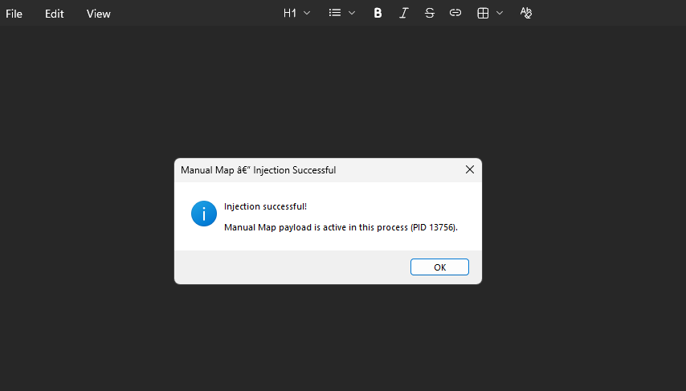
</p>

---

## Screenshots

### Application shell

<p align="center">
  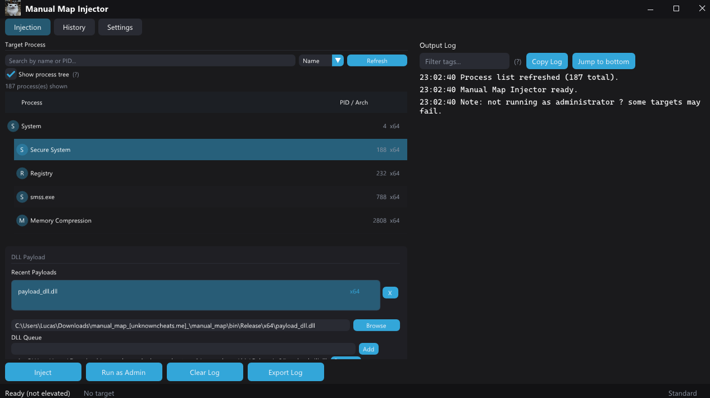
</p>

*Full window on the Injection tab: target list, payload panel, output log, and action buttons.*

| Tab bar | Status bar |
|:---:|:---:|
| 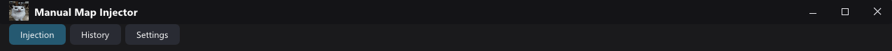 | 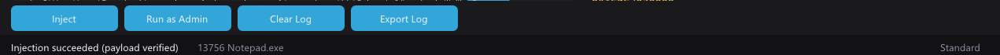 |
| Title bar and three tabs | Ready text, target, Admin/Standard |

| History tab |
|:---:|
| 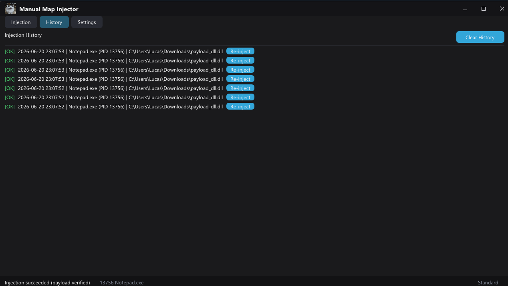 |
| Re-inject and Clear History |

### Injection tab details

| Process list | Payload panel | Output log |
|:---:|:---:|:---:|
| 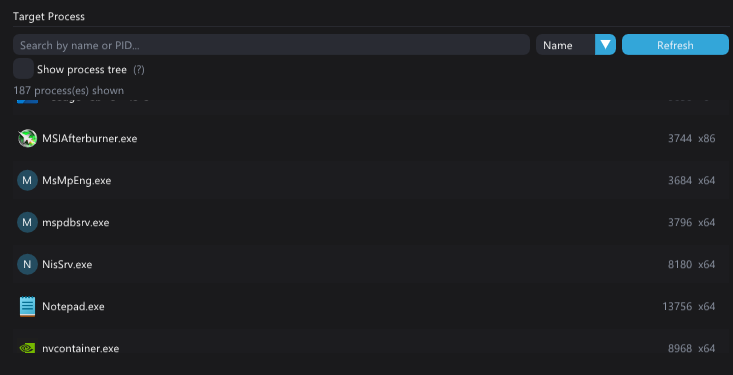 | 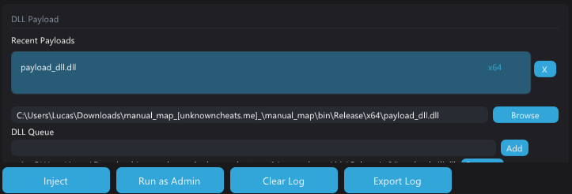 | 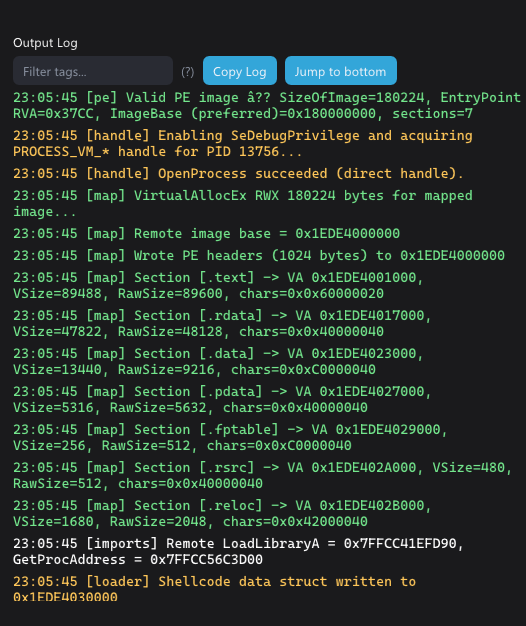 |

### Settings

| Appearance | Capture | Injection | Payload DLL |
|:---:|:---:|:---:|:---:|
| 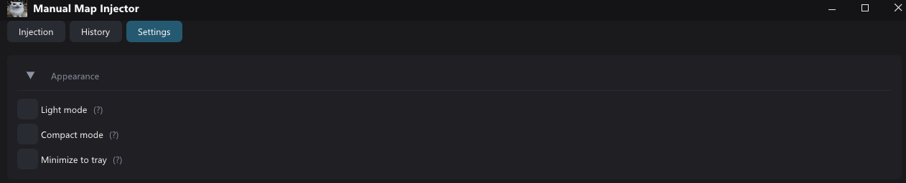 | 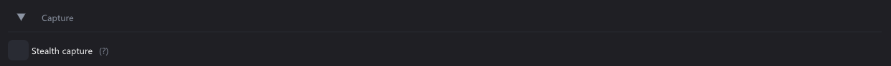 | 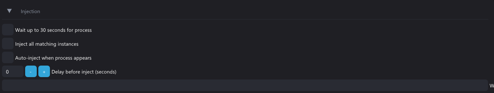 | 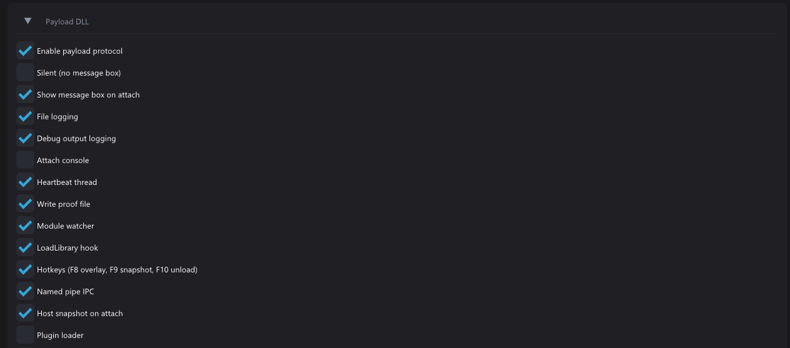 |

### Command palette

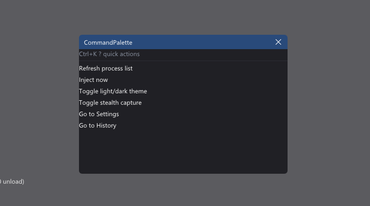

Press **Ctrl+K** in the GUI for quick actions (refresh, inject, theme, stealth, navigation).

---

## Features without screenshots (documented in depth)

These features are fully implemented. Detailed behavior is in [docs/gui-application.md](docs/gui-application.md) and [docs/cli-reference.md](docs/cli-reference.md).

### First-run wizard

Shown once until `first_run_complete=1` in settings. Three steps: pick DLL, pick process, confirm inject.


Source: `manual_map/src/gui/gui_widgets.cpp` (`gui_draw_first_run_wizard`).

### CLI process list

```text
manual_map.exe --list
manual_map.exe --list --search notepad
```

Prints PID and process name table to stdout. Source: `manual_map/src/cli/main.cpp`.

### Drag-and-drop DLL

Drop a `.dll` file onto the GUI window. Highlights the window and sets the payload path. Source: `manual_map/src/gui/main.cpp` (`WM_DROPFILES`), overlay in `gui_draw_drag_overlay`.

---

## System architecture

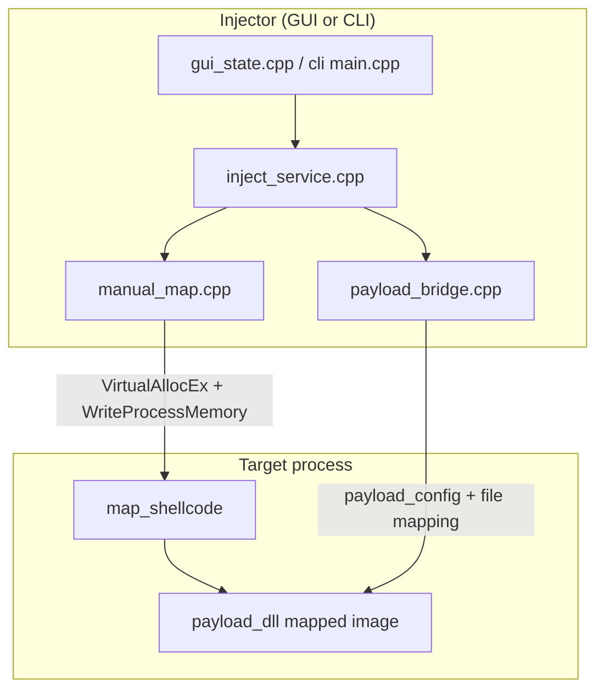

| Layer | Directory | Responsibility |
|-------|-----------|----------------|
| GUI | `manual_map/src/gui/` | ImGui UI, pages, worker thread inject |
| App | `manual_map/src/app/` | Config, inject orchestration, PE/process utils |
| Engine | `manual_map/src/manual_map/` | Remote mapping and loader shellcode |
| Payload | `payload_dll/` | In-target reference DLL and protocol |
| Headers | `manual_map/include/` | Public structs and APIs |

Full module graph: [docs/architecture.md](docs/architecture.md).

---

## Injection sequence

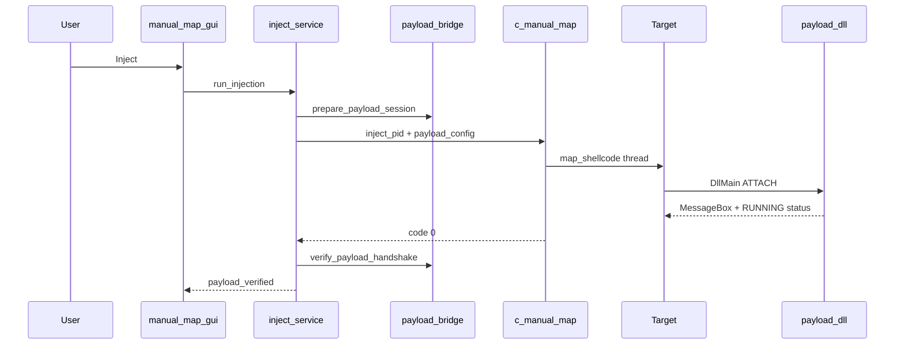

Step-by-step loader status codes (`10`, `20`, `30`, `1`, negatives): [docs/manual-map-engine.md](docs/manual-map-engine.md).

---

## Feature matrix

### GUI highlights

| Feature | Where | Source file |
|---------|-------|-------------|
| Process search / sort / tree | Injection tab | `gui_state.cpp` |
| Favorites (right-click) | Process list | `gui_state.cpp` |
| DLL queue (sequential inject) | Payload panel | `gui_state.cpp` |
| Resizable log split | Draggable splitter | `gui_state.cpp` |
| History + Clear History | History tab | `gui_state.cpp`, `config.cpp` |
| Payload feature toggles | Settings | `gui_state.cpp`, `payload_bridge.cpp` |
| Stealth capture | Settings / Ctrl+K | `window_stealth.cpp` |
| Keyboard shortcuts | Global | `gui_state_handle_shortcuts` |

### Payload DLL highlights

| Feature | Default | Doc section |
|---------|---------|-------------|
| Success MessageBox | On | [payload-dll.md](docs/payload-dll.md) |
| Shared memory handshake | On | [payload-dll.md](docs/payload-dll.md) |
| Named pipe IPC | On | [payload-dll.md](docs/payload-dll.md) |
| LoadLibrary hook | On | [payload-dll.md](docs/payload-dll.md) |
| Hotkeys F8/F9/F10 | On | [payload-dll.md](docs/payload-dll.md) |

### Persistence

All GUI toggles and window geometry persist to:

```text
%APPDATA%\manual_map\settings.ini
```

Every key documented in [docs/configuration-reference.md](docs/configuration-reference.md).

---

## Repository tree

```text
manual_map/
├── README.md
├── manual_map.sln
├── docs/                          ← extended developer documentation
│   ├── INDEX.md
│   ├── architecture.md
│   ├── gui-application.md
│   ├── manual-map-engine.md
│   ├── payload-dll.md
│   ├── cli-reference.md
│   ├── configuration-reference.md
│   ├── build-and-deployment.md
│   └── images/                    ← screenshots 01-13
├── bin/Release/x64/               ← build output
├── manual_map/
│   ├── include/app|manual_map|payload/
│   └── src/app|gui|cli|manual_map/
├── payload_dll/
└── scripts/commit.ps1
```

---

## Documentation index

| Document | You will learn |
|----------|----------------|
| [docs/INDEX.md](docs/INDEX.md) | Master table of contents |
| [docs/architecture.md](docs/architecture.md) | Projects, headers, threads, extension points |
| [docs/gui-application.md](docs/gui-application.md) | Every tab, control, shortcut, overlay |
| [docs/manual-map-engine.md](docs/manual-map-engine.md) | `map_image`, shellcode, error codes |
| [docs/payload-dll.md](docs/payload-dll.md) | Config struct, IPC, exports, hotkeys |
| [docs/cli-reference.md](docs/cli-reference.md) | All CLI flags and interactive mode |
| [docs/configuration-reference.md](docs/configuration-reference.md) | Every INI key |
| [docs/build-and-deployment.md](docs/build-and-deployment.md) | VS 2022, MSBuild, scripts, troubleshooting |

---

## Build requirements

| Requirement | Value |
|-------------|-------|
| OS | Windows 10/11 x64 |
| IDE | Visual Studio 2022 |
| Toolset | v143 |
| Platform | **x64 only** |
| Configuration | Release (recommended) |

```powershell
& "${env:ProgramFiles}\Microsoft Visual Studio\2022\Community\MSBuild\Current\Bin\MSBuild.exe" `
  manual_map.sln /p:Configuration=Release /p:Platform=x64 /m
```

Close `manual_map_gui.exe` before rebuilding the GUI (file lock). See [docs/build-and-deployment.md](docs/build-and-deployment.md).

---

## Keyboard shortcuts (GUI)

| Shortcut | Action |
|----------|--------|
| `F5` | Refresh process list |
| `Ctrl+F` | Focus process search |
| `Ctrl+L` | Focus log filter |
| `Ctrl+K` | Command palette |
| `Enter` | Inject (Injection tab) |
| `Up` / `Down` | Move selection in process list |

---

## Error codes (quick reference)

| Code | Meaning |
|------|---------|
| `0` | Success |
| `0x1000` | Process not found or blocked by safety rules |
| `0x1003` | Cannot open target process (try Admin) |
| `0x1017` | Loader timed out in target |
| `0x101A0001`..`5` | Loader failed inside target (see engine doc) |

Full table: [docs/manual-map-engine.md](docs/manual-map-engine.md#error-code-table-injector-side).

---

## Security notice

Process memory injection is powerful and dangerous on untrusted targets. Use only on machines and processes you are authorized to test. Keep **Safety** rules configured in Settings. Never inject DLLs from untrusted sources.

---

## Third-party

Dear ImGui is vendored at `manual_map/third_party/imgui/` under its own license. The GUI uses the Win32 and DirectX 11 backends.

---

## For new contributors

1. Read [docs/architecture.md](docs/architecture.md) for the module map.
2. Trace one inject from `gui_state.cpp` → `inject_service.cpp` → `manual_map.cpp`.
3. Read loader status progression in [docs/manual-map-engine.md](docs/manual-map-engine.md).
4. Test with `payload_dll.dll` into Notepad before touching protected targets.
5. Use `%APPDATA%\manual_map\settings.ini` and the log panel for debugging.

Questions about a specific file: open the matching doc above and search for the filename.
