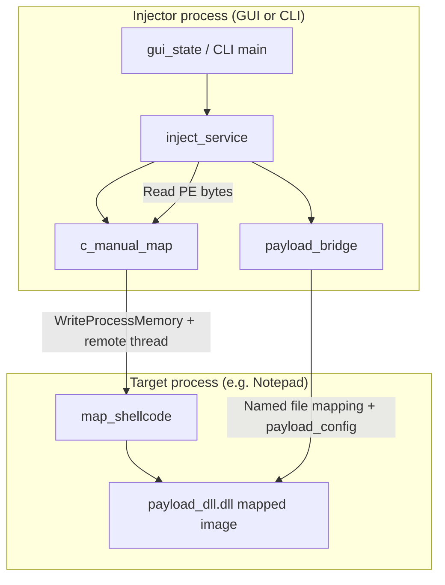
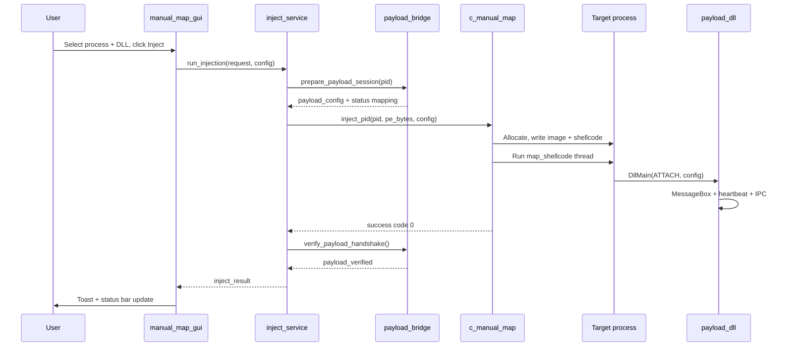

# Manual Map Injector

A Windows x64 toolset for **manual mapping** DLLs into running processes. The project ships three user-facing programs plus a shared core library:

| Artifact | Role |
|----------|------|
| `manual_map_gui.exe` | Primary ImGui desktop application (tabs, settings, logging, injection UI) |
| `manual_map.exe` | Console CLI for scripting and interactive injection |
| `payload_dll.dll` | Reference payload DLL with verification popup, logging, IPC, and diagnostics |
| `manual_map_core.lib` | Static library: manual mapper, config, process list, inject service, PE utilities |

The injector reads a DLL from disk, maps it into a target process without `LoadLibrary` in the injector, and runs a **position-independent loader shellcode** inside the target to apply relocations, resolve imports, run TLS callbacks, and call `DllMain`. The GUI adds process discovery, safety rules, profiles, history, and deep integration with the reference payload.


*Screenshot placeholder: full GUI on the Injection tab showing target list, payload column, output log, and action buttons.*

---

## Table of contents

1. [Quick start](#quick-start)
2. [System overview](#system-overview)
3. [Repository layout](#repository-layout)
4. [Feature summary](#feature-summary)
5. [Typical injection flow](#typical-injection-flow)
6. [Documentation map](#documentation-map)
7. [Requirements and build](#requirements-and-build)
8. [Security and responsibility](#security-and-responsibility)

---

## Quick start

1. **Build** the solution `manual_map.sln` in Visual Studio 2022, configuration **Release**, platform **x64**. See [docs/build-and-deployment.md](docs/build-and-deployment.md).
2. **Run** `bin\Release\x64\manual_map_gui.exe` (optionally as Administrator for protected targets).
3. Open **Notepad** (or any test process), click **Refresh** or press **F5** in the GUI.
4. Select **notepad.exe** in the process list (or type `notepad` in search).
5. Set payload to `bin\Release\x64\payload_dll.dll` via **Browse** or drag-and-drop.
6. Click **Inject**. Notepad should show a **Manual Map - Injection Successful** message box when the reference payload attaches.
7. The GUI status bar should read **Injection succeeded (payload verified)** if the shared-memory handshake completes.


*Screenshot placeholder: MessageBox in Notepad after successful payload_dll injection.*

---

## System overview



**Host side:** The GUI or CLI builds an `inject_request`, optionally prepares a `payload_config` and shared status mapping (`payload_bridge`), reads the DLL into memory, and calls `c_manual_map::inject_pid`.

**Target side:** Allocated memory holds a copy of the PE image, loader shellcode, and `map_shellcode_data`. A hijacked or created thread runs `map_shellcode`, which performs in-process mapping and calls `DllMain(DLL_PROCESS_ATTACH, reserved_data)`.

Detailed stage-by-stage behavior is in [docs/manual-map-engine.md](docs/manual-map-engine.md).

---

## Repository layout

```
manual_map/                          # Solution root
├── manual_map.sln                   # VS solution (4 projects)
├── README.md                        # This file
├── docs/                            # Extended documentation
│   ├── INDEX.md
│   ├── architecture.md
│   ├── gui-application.md
│   ├── manual-map-engine.md
│   ├── payload-dll.md
│   ├── cli-reference.md
│   ├── configuration-reference.md
│   ├── build-and-deployment.md
│   └── images/                      # Screenshot PNGs (see PLACEHOLDER.md)
├── bin/Release/x64/                 # Built binaries (after build)
├── manual_map/                      # Core + GUI + CLI sources
│   ├── include/                     # Public headers (app/, manual_map/, payload/)
│   ├── src/
│   │   ├── app/                     # config, inject_service, process_list, pe_util, payload_bridge
│   │   ├── manual_map/              # c_manual_map, loader_shellcode
│   │   ├── gui/                     # ImGui shell, state, theme, widgets, tray, stealth
│   │   └── cli/                     # manual_map.exe entry
│   ├── manual_map_core.vcxproj
│   ├── manual_map.vcxproj           # CLI executable
│   └── manual_map_gui.vcxproj
├── payload_dll/                     # Reference payload project
│   ├── dllmain.cpp
│   ├── payload_runtime.cpp
│   └── payload_exports.cpp
└── scripts/                         # commit.ps1, helper scripts
```

ImGui lives under `manual_map/third_party/imgui/` as a vendored dependency only. Application logic is under `manual_map/src/` and `payload_dll/`.

---

## Feature summary

### GUI (`manual_map_gui.exe`)

| Area | Capabilities |
|------|----------------|
| **Injection tab** | Process search, flat/tree list, sort, favorites, PID selection, payload path, recent DLLs, DLL queue, PE hash display, inject / run as admin / log actions |
| **History tab** | Last 20 injections with timestamp, target, DLL, success flag, **Re-inject**, **Clear History** |
| **Settings tab** | Appearance, capture stealth, injection options, logging, safety allowlist/blocklist, profiles, payload DLL toggles, advanced import/export, about |
| **Shell** | Custom title bar, tab bar, padded status bar, rounded window |
| **Shortcuts** | F5 refresh, Ctrl+F focus search, Ctrl+L log filter, Ctrl+K palette, Enter inject |
| **Overlays** | Command palette, first-run wizard, drag-drop highlight, toasts |
| **Stealth** | `SetWindowDisplayAffinity` for capture exclusion (Discord/OBS) |


*Screenshot placeholder: title bar and Injection / History / Settings tabs.*

Full GUI documentation: [docs/gui-application.md](docs/gui-application.md).

### Manual map engine

- Process resolution by name or PID, optional wait-for-process, inject-all matching instances
- Handle acquisition with debug privilege and thread hijack for loader execution
- PE validation, section mapping, remote allocation, loader polling with granular status codes
- Optional `reserved` buffer passed to `DllMain` (used for `payload_config`)

Full engine documentation: [docs/manual-map-engine.md](docs/manual-map-engine.md).

### Reference payload (`payload_dll.dll`)

- Success **MessageBox** on attach (default on for Notepad-style verification)
- Shared memory status block and injector handshake
- File log, debug output, proof JSON, module/thread snapshots
- Heartbeat thread, named pipe IPC, LoadLibrary hook, module watcher, hotkeys (F8/F9/F10), optional overlay window, plugin loader
- Exported API: `PayloadGetVersion`, `PayloadGetStatus`, `PayloadRequestUnload`, `PayloadDumpModules`, `PayloadSnapshotMemory`

Full payload documentation: [docs/payload-dll.md](docs/payload-dll.md).

### CLI (`manual_map.exe`)

- `--process`, `--pid`, `--dll`, `--list`, `--search`, `--wait`, `--admin`, `--gui`
- Interactive mode when run without arguments

Full CLI documentation: [docs/cli-reference.md](docs/cli-reference.md).

### Persistence

- Settings: `%APPDATA%\manual_map\settings.ini`
- Profiles, recent DLLs, injection history (max 20), window geometry, all GUI toggles

Full key list: [docs/configuration-reference.md](docs/configuration-reference.md).

---

## Typical injection flow



1. User selects target and payload in the GUI (or CLI fills `inject_request`).
2. `run_injection` reads the DLL file into a byte vector.
3. If the DLL exports `PayloadGetVersion` (or is named `payload_dll.dll`) and payload protocol is enabled, `payload_bridge` creates `Local\ManualMapPayloadStatus_<pid>` and fills `payload_config` (feature flags, paths, CLI notes, pipe name).
4. `c_manual_map::map_image` maps sections, writes loader shellcode, starts remote loader, polls `map_shellcode_data.status` until complete or error.
5. On success, `verify_payload_handshake` waits for `PAYLOAD_STATUS_RUNNING` in shared memory (up to 8 seconds).
6. GUI records history entry and updates status text.

---

## Documentation map

| Need | Read |
|------|------|
| File-level architecture and dependencies | [docs/architecture.md](docs/architecture.md) |
| Every GUI panel and source file | [docs/gui-application.md](docs/gui-application.md) |
| Loader status codes and mapping steps | [docs/manual-map-engine.md](docs/manual-map-engine.md) |
| Payload IPC, exports, hotkeys | [docs/payload-dll.md](docs/payload-dll.md) |
| Command-line usage | [docs/cli-reference.md](docs/cli-reference.md) |
| Every `settings.ini` key | [docs/configuration-reference.md](docs/configuration-reference.md) |
| Build outputs and scripts | [docs/build-and-deployment.md](docs/build-and-deployment.md) |
| Screenshot filenames | [docs/images/PLACEHOLDER.md](docs/images/PLACEHOLDER.md) |

---

## Requirements and build

- **OS:** Windows 10/11 x64
- **IDE:** Visual Studio 2022 with Desktop development C++ workload
- **Platform:** x64 only (Release recommended)
- **Output directory:** `bin\Release\x64\`

```
manual_map.sln
  ├── manual_map_core   → manual_map_core.lib
  ├── manual_map        → manual_map.exe
  ├── manual_map_gui    → manual_map_gui.exe
  └── payload_dll       → payload_dll.dll
```

See [docs/build-and-deployment.md](docs/build-and-deployment.md) for step-by-step build, admin elevation, and commit scripts.

---

## Security and responsibility

This software manipulates live process memory. It is intended for **local debugging, research, and authorized testing** on systems you own or have explicit permission to test. Many games and commercial applications prohibit injection; using this tool against them may violate terms of service or law. Run elevated only when required, keep allowlist/blocklist rules enabled in production-like environments, and never inject untrusted DLLs.

---

## License and attribution

ImGui is bundled under its own license in `manual_map/third_party/imgui/`. Application source in `manual_map/src/` and `payload_dll/` is part of this repository; refer to repository license terms if present.

For questions about a specific module, open the linked doc in `docs/` and search for the source filename cited in that section.
