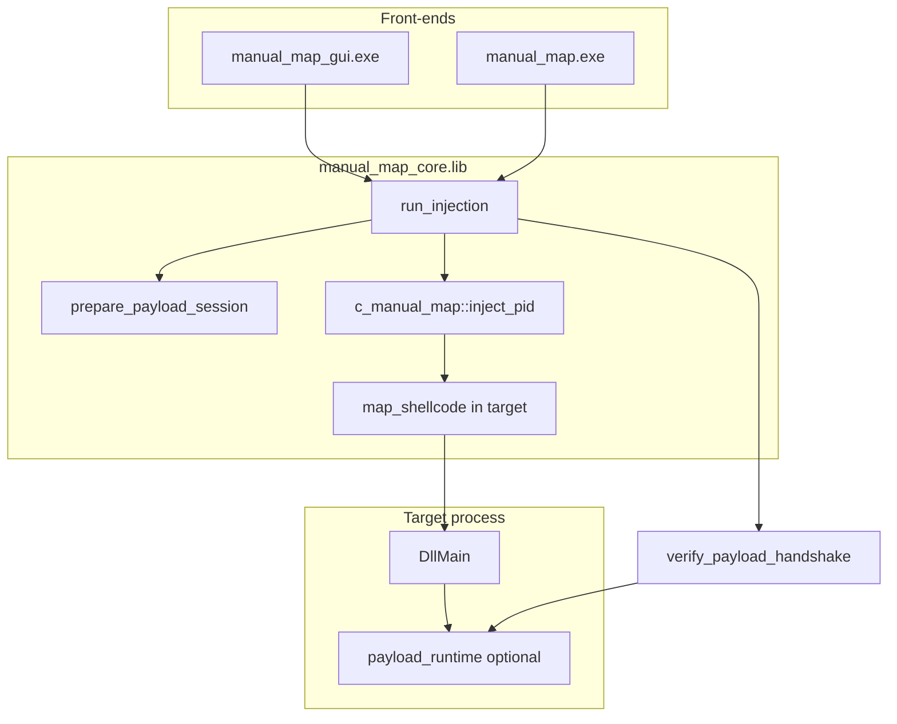

# Documentation index

Complete reference for the Manual Map Injector repository. Start with the [main README](../README.md) for install and quick start, then use the topic guides below for implementation detail.

This index maps every doc to source files, typical workflows, and cross-links so you can jump from user-facing behavior to the exact function that implements it.

---

## Topic guides

| Document | What you will learn | Primary source paths |
|----------|---------------------|----------------------|
| [Architecture](architecture.md) | Solution layout, build targets, data flow, module dependencies, thread model | `manual_map.sln`, `manual_map/include/`, `manual_map/src/` |
| [GUI application](gui-application.md) | Every screen, control, shortcut, overlay, worker thread, Win32 integration | `manual_map/src/gui/` |
| [Manual map engine](manual-map-engine.md) | PE mapping, loader shellcode, status codes, handle acquisition, remote R/W | `manual_map/src/manual_map/manual_map.cpp`, `loader_shellcode.cpp` |
| [Payload DLL](payload-dll.md) | Sample payload features, IPC, exports, handshake, hotkeys, overlay | `payload_dll/`, `manual_map/include/payload/payload_shared.hpp` |
| [CLI reference](cli-reference.md) | `manual_map.exe` flags, interactive mode, exit codes, automation | `manual_map/src/cli/main.cpp` |
| [Configuration reference](configuration-reference.md) | `settings.ini` keys, profiles, history, safety rules, load/save API | `manual_map/src/app/config.cpp`, `config.hpp` |
| [Build and deployment](build-and-deployment.md) | Visual Studio, MSBuild, outputs, scripts, elevation, troubleshooting | `manual_map.sln`, `scripts/` |
| [Screenshot placeholders](images/PLACEHOLDER.md) | PNG assets under `docs/images/` (01-13 provided, 14-16 optional) | `docs/images/` |

---

## Recommended reading order

### First-time developer onboarding

1. [Architecture](architecture.md) - understand the four projects and how GUI/CLI share `manual_map_core.lib`.
2. [Build and deployment](build-and-deployment.md) - produce `bin\Release\x64\` outputs.
3. [GUI application](gui-application.md) or [CLI reference](cli-reference.md) - pick your front-end.
4. [Manual map engine](manual-map-engine.md) - read before changing injection behavior.
5. [Payload DLL](payload-dll.md) - read if you ship a custom in-process DLL.
6. [Configuration reference](configuration-reference.md) - persistent state and safety rules.

### Debugging a failed inject

1. Note the hex code in the GUI output log or CLI stdout.
2. Look up the code in [Manual map engine - Error code table](manual-map-engine.md#error-code-table-injector-side) or `manual_map/src/app/errors.cpp`.
3. If payload handshake failed, see [Payload DLL - Shared status block](payload-dll.md#shared-status-block-payload_shared_status).
4. If blocked before inject, check [Configuration reference - Safety](configuration-reference.md#safety).

### Adding a new GUI setting

1. Add field to `app_config` in `manual_map/include/app/config.hpp`.
2. Wire `apply_line` and save logic in `manual_map/src/app/config.cpp`.
3. Add UI control in `draw_settings_page` inside `manual_map/src/gui/gui_state.cpp`.
4. Document the new key in [Configuration reference](configuration-reference.md).

---

## Repository map (documentation vs code)

```
manual_map/                          # repo root
├── README.md                        # user quick start (not expanded here)
├── docs/                            # this folder
│   ├── INDEX.md                     # you are here
│   ├── architecture.md
│   ├── gui-application.md
│   ├── manual-map-engine.md
│   ├── payload-dll.md
│   ├── cli-reference.md
│   ├── configuration-reference.md
│   ├── build-and-deployment.md
│   └── images/                      # screenshots 01-13
├── manual_map/                      # core + front-ends (C++)
│   ├── include/app/                 # config, inject_service, payload_bridge, pe_util
│   ├── include/manual_map/          # c_manual_map API
│   ├── include/payload/             # payload_shared.hpp (shared with payload_dll)
│   ├── src/app/                     # config, inject_service, process_list, errors
│   ├── src/manual_map/              # manual_map.cpp, loader_shellcode.cpp
│   ├── src/gui/                     # ImGui application
│   └── src/cli/                     # console front-end
├── payload_dll/                     # reference payload DLL
├── bin/Release/x64/                 # build outputs (after Release x64)
└── scripts/                         # commit.ps1, ensure-gui-not-running.ps1
```

---

## End-to-end inject flow (all front-ends)

Every successful inject path eventually calls `run_injection` in `manual_map/src/app/inject_service.cpp`, which reads the DLL from disk and invokes `c_manual_map::inject_pid` in `manual_map/src/manual_map/manual_map.cpp`.



Details: [Architecture - Runtime data flow](architecture.md), [Manual map engine](manual-map-engine.md), [Payload DLL](payload-dll.md).

---

## Screenshots

Visual references live under `docs/images/`. Files **01** through **13** are included in the repo. Files **14** through **16** are optional and documented with text and diagrams instead of PNGs. See [images/PLACEHOLDER.md](images/PLACEHOLDER.md).

| Image | Doc references |
|-------|----------------|
| `01-main-window-injection.png` | [Architecture](architecture.md), [GUI](gui-application.md) |
| `02-tab-bar.png` | [GUI - Tab bar](gui-application.md#tab-bar-draw_tab_bar) |
| `03-process-list.png` | [GUI - Target panel](gui-application.md#target-panel-lefttargetpanel) |
| `04-payload-panel.png` | [GUI - Payload panel](gui-application.md#payload-panel-leftpayloadpanel) |
| `05-output-log.png` | [GUI - Output log](gui-application.md#output-log-draw_log_panel) |
| `06-inject-success-popup.png` | [Payload DLL](payload-dll.md) |
| `07-status-bar.png` | [GUI - Window shell](gui-application.md#window-shell-gui_shellcpp) |
| `08-history-tab.png` | [GUI - History tab](gui-application.md#history-tab-draw_history_page) |
| `09-settings-appearance.png` | [GUI - Settings](gui-application.md#settings-tab-draw_settings_page) |
| `10-settings-capture.png` | [GUI - Settings](gui-application.md#settings-tab-draw_settings_page) |
| `11-settings-injection.png` | [GUI - Settings](gui-application.md#settings-tab-draw_settings_page) |
| `12-settings-payload.png` | [GUI - Settings](gui-application.md#settings-tab-draw_settings_page), [Configuration](configuration-reference.md#payload-dll-settings) |
| `13-command-palette.png` | [GUI - Command palette](gui-application.md#command-palette-gui_draw_command_palette) |

---

## Developer quick reference

| Task | Start here |
|------|------------|
| Change loader reloc/import logic | `manual_map/src/manual_map/loader_shellcode.cpp` - see [How to modify the loader](manual-map-engine.md#how-to-modify-the-loader) |
| Add inject logging | Pass `options.log` via `inject_request.log` or `manual_map_options.log` |
| Custom payload without exports | Pass `payload_config` via manual map `reserved`; see [Payload DLL](payload-dll.md) |
| Block/allow processes | `is_process_allowed` in `manual_map/src/app/config.cpp` |
| Automate inject from script | [CLI reference](cli-reference.md) or link `manual_map_core.lib` and call `run_injection` |
| Fix GUI not updating during inject | Worker thread in `gui_state.cpp`; main thread polls `poll_injection` |

---

## Related reading outside this folder

- [main README](../README.md) - installation, first inject, disclaimer
- ImGui vendor docs under `manual_map/third_party/imgui/docs/` (upstream only, not application behavior)
