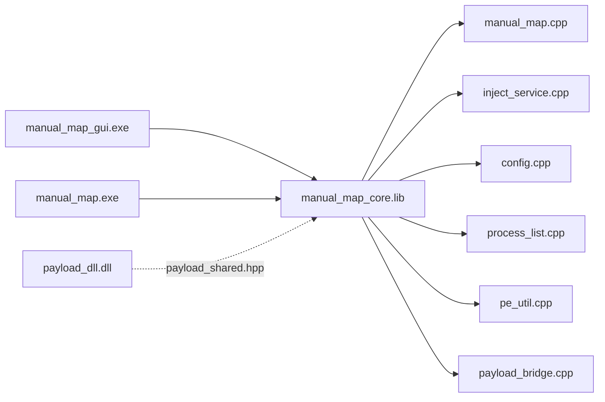
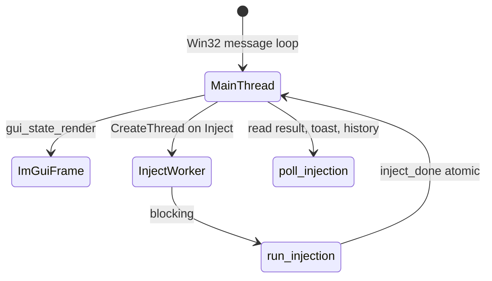

# Architecture

This document describes how the Manual Map Injector solution is organized, which modules depend on which, and how data moves from the user interface to code running inside a target process.

*Screenshot placeholder: full application window for context.*

---

## Solution projects

| Project | Output | Links against | Purpose |
|---------|--------|---------------|---------|
| `manual_map_core` | `manual_map_core.lib` | Windows SDK, ntdll (implicit) | Shared injection engine, config, process enumeration, PE analysis, payload bridge |
| `manual_map` | `manual_map.exe` | `manual_map_core.lib` | CLI front-end |
| `manual_map_gui` | `manual_map_gui.exe` | `manual_map_core.lib`, ImGui, DirectX 11 | GUI front-end |
| `payload_dll` | `payload_dll.dll` | kernel32, user32, psapi, advapi32 | In-target reference payload |

---

## Header layout (`manual_map/include/`)

| Path | Contents |
|------|----------|
| `app/config.hpp` | `app_config`, history, profiles, payload settings, load/save API |
| `app/inject_service.hpp` | `inject_request`, `inject_result`, `run_injection` |
| `app/payload_bridge.hpp` | Session prep, handshake verify, IPC ping helper |
| `app/process_list.hpp` | `process_entry`, list/filter/sort/wait APIs |
| `app/pe_util.hpp` | `pe_info`, `analyze_pe_file`, `pe_has_export` |
| `app/errors.hpp` | `inject_error_message`, `inject_error_message_w` |
| `manual_map/manual_map.hpp` | `c_manual_map`, `map_shellcode_data`, `map_reserved_data` |
| `payload/payload_shared.hpp` | `payload_config`, `payload_shared_status`, feature flags, exports |
| `core.hpp` | Umbrella include for core translation units |

---

## Source layout (`manual_map/src/`)

### `app/`

| File | Responsibility |
|------|----------------|
| `config.cpp` | Parse and write `%APPDATA%\manual_map\settings.ini`, history cap (20), allowlist logic |
| `inject_service.cpp` | Orchestrates read DLL, payload session, per-PID inject, logging callbacks |
| `payload_bridge.cpp` | Detect payload-capable DLLs, create file mapping, build `payload_config`, verify handshake, IPC client |
| `process_list.cpp` | Toolhelp snapshot, enrichment, sort modes, wait for process by name |
| `pe_util.cpp` | PE machine type, export list (display), FNV hash, full export scan for `PayloadGetVersion` |
| `errors.cpp` | Human-readable strings for injector and loader error codes |

### `manual_map/`

| File | Responsibility |
|------|----------------|
| `manual_map.cpp` | `c_manual_map` implementation: PID lookup, handle hijack, `map_image`, `run_loader`, remote R/W |
| `loader_shellcode.cpp` | Position-independent `map_shellcode` and `map_shellcode_end` (own section `.loader`) |

### `gui/`

| File | Responsibility |
|------|----------------|
| `main.cpp` | Win32 entry, message loop, DXGI/ImGui init |
| `gui_app.cpp` | Window creation, resize, drag-drop files, hit testing delegate |
| `gui_shell.cpp` | Title bar, tabs, status bar, main layout regions |
| `gui_state.cpp` | All pages: injection, history, settings; worker thread inject; shortcuts |
| `gui_state.hpp` | `gui_app_state` aggregate |
| `gui_theme.cpp` | Colors, fonts, compact tokens, fixed blue accent |
| `gui_widgets.cpp` | Buttons, section cards, command palette, wizard, toasts, help markers |
| `gui_process_icons.cpp` | Executable icon cache for process list |
| `gui_tray.cpp` | System tray minimize |
| `window_stealth.cpp` | `SetWindowDisplayAffinity` wrapper |

### `cli/`

| File | Responsibility |
|------|----------------|
| `main.cpp` | Argument parsing, interactive picker, calls `run_injection` |

---

## Runtime threads (GUI)

- **Main thread:** ImGui UI, input, `gui_state_new_frame`, `poll_injection`.
- **Inject worker:** Runs `run_injection` so the UI stays responsive; sets `inject_done` when finished.

---

## Configuration and state ownership

| State | Storage | Lifetime |
|-------|---------|----------|
| User preferences | `%APPDATA%\manual_map\settings.ini` | Persistent |
| Session UI | `gui_app_state` in memory | Process lifetime |
| Inject log text | `gui_app_state.log` + mutex | Process lifetime |
| Payload handshake | Named file mapping `Local\ManualMapPayloadStatus_<pid>` | Created by injector, opened by payload |
| Payload config copy | Remote process memory via manual map `reserved` | Target lifetime |
| PE bytes during inject | `std::vector<uint8_t>` on injector stack/heap | Single inject call |

---

## External dependencies

| Dependency | Used by | Notes |
|------------|---------|-------|
| ImGui + Win32 + DX11 backends | GUI only | Vendored under `third_party/imgui` |
| Windows API | All targets | Toolhelp, PSAPI, pipes, file mapping |
| NT APIs | Core mapper | Optional handle duplication paths in `manual_map.cpp` |

---

## Extension points for developers

1. **Custom payload DLL:** Implement `DllMain` to read `payload_config*` from `lpReserved` when magic is `PAYLOAD_CONFIG_MAGIC`, or export `PayloadGetVersion` for auto-detection.
2. **CLI automation:** Call `run_injection` from your own tool by linking `manual_map_core.lib`.
3. **New GUI settings:** Add fields to `app_config`, wire `config.cpp` load/save, add checkbox in `draw_settings_page`.
4. **Loader behavior:** Modify `loader_shellcode.cpp` (keep section `.loader` and disable optimizations as in vcxproj).

See linked docs for file-level behavior: [GUI](gui-application.md), [engine](manual-map-engine.md), [payload](payload-dll.md).
