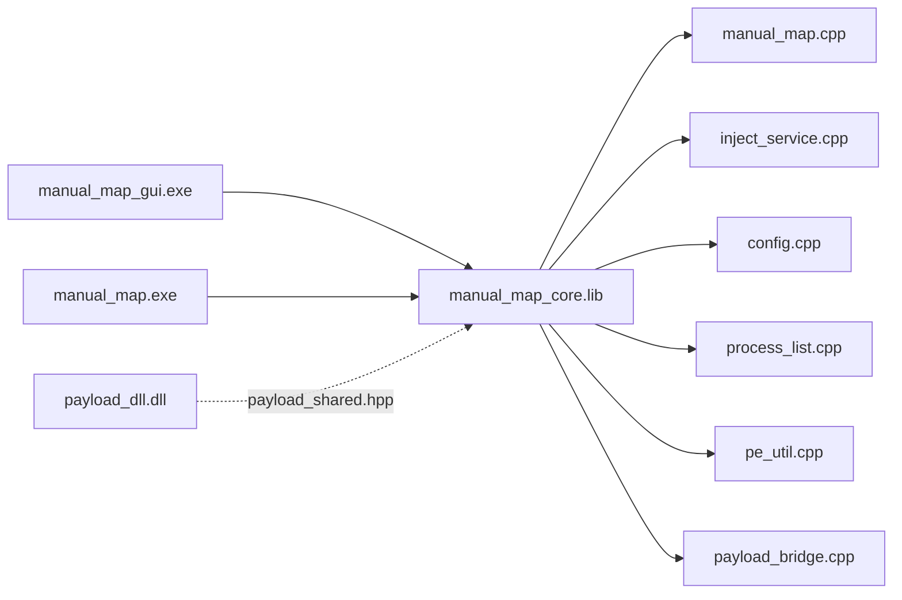
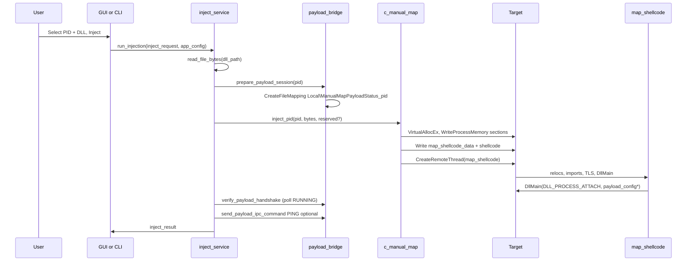
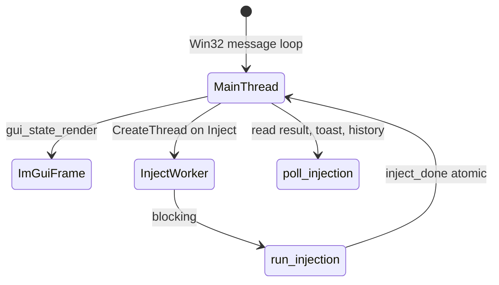

# Architecture

This document describes how the Manual Map Injector solution is organized, which modules depend on which, and how data moves from the user interface to code running inside a target process. Use it as the map before editing any source file.


*Full application window on the Injection tab: target panel (left), payload panel (left bottom), output log (right), action buttons, status bar.*

See also: [Documentation index](INDEX.md), [GUI application](gui-application.md), [Manual map engine](manual-map-engine.md), [Configuration reference](configuration-reference.md).

---

## Solution projects

| Project | Output | Links against | Purpose |
|---------|--------|---------------|---------|
| `manual_map_core` | `manual_map_core.lib` | Windows SDK, ntdll (implicit) | Shared injection engine, config, process enumeration, PE analysis, payload bridge |
| `manual_map` | `manual_map.exe` | `manual_map_core.lib` | CLI front-end |
| `manual_map_gui` | `manual_map_gui.exe` | `manual_map_core.lib`, ImGui, DirectX 11 | GUI front-end |
| `payload_dll` | `payload_dll.dll` | kernel32, user32, psapi, advapi32 | In-target reference payload |

Open the solution at repository root: `manual_map.sln`.



**Dependency rule:** GUI and CLI must not duplicate inject logic. Both call `run_injection` in `manual_map/src/app/inject_service.cpp`. The mapper singleton `c_manual_map` lives inside that translation unit's anonymous namespace.

---

## Header layout (`manual_map/include/`)

| Path | Contents |
|------|----------|
| `app/config.hpp` | `app_config`, `injection_history_entry`, `inject_profile`, load/save API |
| `app/inject_service.hpp` | `inject_request`, `inject_result`, `run_injection`, `pick_dll_path`, elevation helpers |
| `app/payload_bridge.hpp` | `payload_inject_session`, `prepare_payload_session`, `verify_payload_handshake`, IPC |
| `app/process_list.hpp` | `process_entry`, `list_processes`, `filter_processes`, `wait_for_process` |
| `app/pe_util.hpp` | `pe_info`, `analyze_pe_file`, `pe_has_export` |
| `app/errors.hpp` | `inject_error_message`, `inject_error_message_w` |
| `manual_map/manual_map.hpp` | `c_manual_map`, `map_shellcode_data`, `map_reserved_data`, `manual_map_options` |
| `payload/payload_shared.hpp` | `payload_config`, `payload_shared_status`, feature flags, export declarations |
| `core.hpp` | Umbrella include for core translation units |

Public inject API for embedders:

```cpp
// manual_map/include/app/inject_service.hpp
inject_result run_injection( inject_request request , app_config& config );
```

Mapper API:

```cpp
// manual_map/include/manual_map/manual_map.hpp
class c_manual_map {
    uint32_t inject( const wchar_t* process_name, uint8_t* data, size_t size,
                     void* reserved, size_t reserved_size, manual_map_options options );
    uint32_t inject_pid( uint32_t pid, uint8_t* data, size_t size,
                         void* reserved, size_t reserved_size, manual_map_options options );
};
```

---

## Source layout (`manual_map/src/`)

### `app/` - shared services

| File | Responsibility | Key symbols |
|------|----------------|-------------|
| `config.cpp` | Parse and write `%APPDATA%\manual_map\settings.ini`, history cap (20), allowlist logic | `load_config`, `save_config`, `is_process_allowed`, `remember_dll` |
| `inject_service.cpp` | Orchestrates read DLL, payload session, per-PID inject, logging callbacks | `run_injection`, `read_file_bytes`, `relaunch_as_admin` |
| `payload_bridge.cpp` | Detect payload-capable DLLs, create file mapping, build `payload_config`, verify handshake, IPC client | `prepare_payload_session`, `build_payload_config`, `send_payload_ipc_command` |
| `process_list.cpp` | Toolhelp snapshot, enrichment (elevation, WOW64, path), sort/filter, wait for process | `list_processes`, `find_processes_by_name`, `wait_for_process` |
| `pe_util.cpp` | PE machine type, export list (display), FNV hash, full export scan for `PayloadGetVersion` | `analyze_pe_file`, `pe_has_export` |
| `errors.cpp` | Human-readable strings for injector and loader error codes | `inject_error_message`, `inject_error_message_w` |

Line-by-line inject orchestration in `run_injection` (`manual_map/src/app/inject_service.cpp`):

1. **Validate DLL path** - empty path returns code `0x1001` with log line (reuses PE invalid code slot for service-level errors).
2. **Optional delay** - `Sleep(request.delay_ms)` when GUI or caller set delay.
3. **Read file** - `read_file_bytes` loads entire DLL into `std::vector<uint8_t>`. Empty vector returns `0x1001`.
4. **Per-PID lambda `inject_single_pid`**:
   - Calls `prepare_payload_session(pid, config, request)`.
   - If session active, passes `&session.config` as `reserved` with `sizeof(payload_config)`.
   - Calls `g_manual_map->inject_pid(...)`.
   - On success with payload enabled: `verify_payload_handshake(session, 8000, log)`.
   - If verified and `config.payload_ipc_pipe`: `send_payload_ipc_command(PAYLOAD_IPC_PING)`.
   - Always `cleanup_payload_session(session)`.
5. **Target resolution** - by PID (with safety check on resolved name), by name with wait, by name with inject-all loop, or single first match.
6. **Success path** - `remember_dll`, `save_config`, success log.
7. **Failure path** - hex code plus `inject_error_message_w` in log.

### `manual_map/` - PE mapper

| File | Responsibility |
|------|----------------|
| `manual_map.cpp` | `c_manual_map`: PID lookup, handle hijack, `map_image`, `run_loader`, remote R/W |
| `loader_shellcode.cpp` | Position-independent `map_shellcode` and `map_shellcode_end` (own section `.loader`) |

### `gui/` - ImGui front-end

| File | Responsibility |
|------|----------------|
| `main.cpp` | Win32 entry, message loop, DXGI/ImGui init, `WM_DROPFILES`, tray hooks |
| `gui_app.cpp` | Window creation, resize, drag-drop path setter, hit testing delegate |
| `gui_shell.cpp` | Title bar, tabs, status bar, main layout regions |
| `gui_state.cpp` | All pages: injection, history, settings; worker thread inject; shortcuts |
| `gui_state.hpp` | `gui_app_state` aggregate |
| `gui_theme.cpp` | Colors, fonts, compact tokens, fixed blue accent |
| `gui_widgets.cpp` | Buttons, section cards, command palette, wizard, toasts, help markers |
| `gui_process_icons.cpp` | Executable icon cache for process list |
| `gui_tray.cpp` | System tray minimize |
| `window_stealth.cpp` | `SetWindowDisplayAffinity` wrapper |

### `cli/` - console front-end

| File | Responsibility |
|------|----------------|
| `main.cpp` | Argument parsing, interactive picker, calls `run_injection`, `--gui` launcher |

Details: [GUI application](gui-application.md), [CLI reference](cli-reference.md).

---

## Runtime data flow (single inject)



---

## Runtime threads (GUI)



- **Main thread:** ImGui UI, input, `gui_state_new_frame`, `poll_injection`, `poll_auto_inject`, `poll_watch_folder`.
- **Inject worker:** `inject_worker` in `manual_map/src/gui/gui_state.cpp` runs `run_injection` so the UI stays responsive. Sets `inject_done` when finished. Supports sequential DLL queue via chained worker contexts.

**Synchronization:** `gui_app_state.injecting`, `inject_done`, and `inject_result` are updated from the worker; main thread reads them in `poll_injection` with acquire/release ordering.

**Edge case:** If user clicks Inject with no target selected, `launch_single_injection` logs a hint, sets `inject_done` without calling `run_injection`, and clears `injecting`.

---

## Configuration and state ownership

| State | Storage | Lifetime |
|-------|---------|----------|
| User preferences | `%APPDATA%\manual_map\settings.ini` | Persistent |
| Session UI | `gui_app_state` in memory | Process lifetime |
| Inject log text | `gui_app_state.log` + mutex | Process lifetime |
| Payload handshake | Named file mapping `Local\ManualMapPayloadStatus_<pid>` | Created by injector, opened by payload |
| Payload config copy | Remote process memory via manual map `reserved` | Target lifetime (copied at map time) |
| PE bytes during inject | `std::vector<uint8_t>` on injector heap | Single `run_injection` call |

Config path resolution (`manual_map/src/app/config.cpp`):

1. `SHGetFolderPathW(CSIDL_APPDATA)`.
2. Append `\manual_map\`, `CreateDirectoryW`.
3. File `settings.ini`.

See [Configuration reference](configuration-reference.md) for every key.

---

## External dependencies

| Dependency | Used by | Notes |
|------------|---------|-------|
| ImGui + Win32 + DX11 backends | GUI only | Vendored under `manual_map/third_party/imgui` |
| Windows API | All targets | Toolhelp, PSAPI, pipes, file mapping |
| NT APIs | Core mapper | `NtQuerySystemInformation`, `NtDuplicateObject` in `manual_map.cpp` |

---

## Extension points for developers

1. **Custom payload DLL:** Implement `DllMain` to read `payload_config*` from `lpReserved` when magic is `PAYLOAD_CONFIG_MAGIC`, or export `PayloadGetVersion` for auto-detection. See [Payload DLL](payload-dll.md).
2. **CLI automation:** Call `run_injection` from your own tool by linking `manual_map_core.lib`. Include `app/inject_service.hpp` and `app/config.hpp`.
3. **New GUI settings:** Add fields to `app_config`, wire `config.cpp` load/save, add checkbox in `draw_settings_page` in `gui_state.cpp`.
4. **Loader behavior:** Modify `loader_shellcode.cpp` (keep section `.loader` and disable optimizations as in vcxproj).

---

## How to modify architecture safely

### Add a new core service module

1. Add headers under `manual_map/include/app/`.
2. Add `.cpp` under `manual_map/src/app/`.
3. Register the file in `manual_map_core.vcxproj`.
4. Include from `inject_service.cpp` or GUI as needed, not from `loader_shellcode.cpp` (PIC constraints).

### Share types between injector and payload

Put packed structs and magic constants in `manual_map/include/payload/payload_shared.hpp`. Both `manual_map_core` and `payload_dll` include this header. Do not pull GUI or ImGui headers into payload code.

### Add a third front-end (e.g. service)

Link `manual_map_core.lib`, call `load_config`, fill `inject_request`, call `run_injection`. Reuse the same `app_config` safety and payload toggles.

---

## Debugging architecture-level issues

| Symptom | Likely layer | Where to look |
|---------|--------------|---------------|
| Inject never starts from GUI | Front-end validation | `launch_injection`, `launch_single_injection` in `gui_state.cpp` |
| Code 0x1000 before mapper | Safety or missing target | `is_process_allowed`, process name/PID in `inject_service.cpp` |
| Code 0x1003 | Handle acquisition | `acquire_process_handle`, `hijack_handle` in `manual_map.cpp` |
| Code 0x1017 or 0x101Axxxx | In-target loader | `run_loader` poll loop, `loader_shellcode.cpp` |
| Payload not verified | IPC bridge | `verify_payload_handshake` in `payload_bridge.cpp`, payload init thread |
| Settings not persisting | Config I/O | `save_config`, `%APPDATA%\manual_map\settings.ini` |

Enable verbose mapper logs by ensuring `inject_request.log` or `manual_map_options.log` is set. GUI always attaches a log callback that writes to the output panel via `append_log`.

---

## Common failure modes

| Failure | Cause | Mitigation |
|---------|-------|------------|
| Blocklist hit | Process name in `process_rule` with `use_allowlist=0` | Remove rule or switch mode in Settings - Safety |
| Allowlist miss | Name not listed with `use_allowlist=1` | Add exact process name (case-insensitive match) |
| x86 target | Mapper validates x64 PE only | Use x64 DLL and x64 target |
| Stale handle hijack | Wrong duplicated handle | Run elevated; close protected target first |
| Payload session disabled | `CreateFileMapping` failed | Check name collision; retry inject |

---

## Related reading

- [GUI application](gui-application.md) for file-level UI behavior
- [Manual map engine](manual-map-engine.md) for `map_image` and shellcode
- [Payload DLL](payload-dll.md) for `reserved` / `payload_config` usage
- [Build and deployment](build-and-deployment.md) for project outputs
