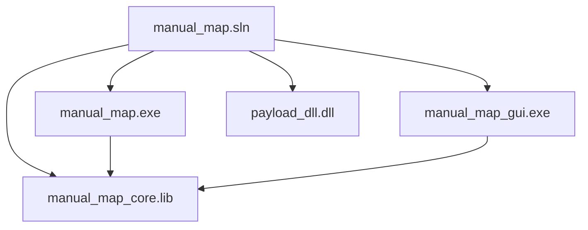

# Build and deployment

How to compile, locate outputs, run elevated, and use repository scripts.

See also: [Architecture](architecture.md), [Documentation index](INDEX.md), [CLI reference](cli-reference.md), [GUI application](gui-application.md).

---

## Prerequisites

| Requirement | Details |
|-------------|---------|
| Operating system | Windows 10 or 11 x64 |
| IDE | Visual Studio 2022 (v143 toolset) |
| Workload | Desktop development with C++ |
| Platform | **x64 only** (no Win32 target in solution) |
| SDK | Windows 10 SDK (10.0, as specified in vcxproj) |

Optional: Windows SDK Debugging Tools for advanced inject debugging (not required to build).

---

## Solution structure

Open at repository root:

```
manual_map.sln
```

Projects:

| Project | vcxproj path | Output |
|---------|--------------|--------|
| manual_map_core | `manual_map/manual_map_core.vcxproj` | `manual_map_core.lib` |
| manual_map | `manual_map/manual_map.vcxproj` | `manual_map.exe` |
| manual_map_gui | `manual_map/manual_map_gui.vcxproj` | `manual_map_gui.exe` |
| payload_dll | `payload_dll/payload_dll.vcxproj` | `payload_dll.dll` |



Build order: **manual_map_core** first (dependency), then exe/gui/dll in any order.

---

## Build steps (Visual Studio)

1. Open `manual_map.sln`.
2. Set configuration to **Release** and platform to **x64**.
3. Build - Build Solution (F7).
4. Confirm outputs under **`bin\Release\x64\`** at repository root.

### Close GUI before rebuild

If linker reports **LNK1104** (cannot open `manual_map_gui.exe`), close the running GUI or run:

```powershell
.\scripts\ensure-gui-not-running.ps1
```

---

## Command-line MSBuild

Full solution:

```powershell
& "${env:ProgramFiles}\Microsoft Visual Studio\2022\Community\MSBuild\Current\Bin\MSBuild.exe" `
  manual_map.sln /p:Configuration=Release /p:Platform=x64 /m
```

Adjust VS path for Professional/Enterprise/Build Tools installs.

Individual projects:

```powershell
MSBuild.exe manual_map\manual_map_gui.vcxproj /p:Configuration=Release /p:Platform=x64
MSBuild.exe payload_dll\payload_dll.vcxproj /p:Configuration=Release /p:Platform=x64
MSBuild.exe manual_map\manual_map.vcxproj /p:Configuration=Release /p:Platform=x64
MSBuild.exe manual_map\manual_map_core.vcxproj /p:Configuration=Release /p:Platform=x64
```

---

## Output layout

After Release x64 build:

```
bin/Release/x64/
├── manual_map.exe
├── manual_map_gui.exe
├── payload_dll.dll
├── payload_dll.lib          # import library for payload exports
├── manual_map_core.lib      # may also appear under manual_map/bin per project OutputDirectory
└── *.pdb                    # if generated (Debug always, Release if enabled)
```

GUI post-build may copy `app_icon.png` beside the executable (see `manual_map_gui.vcxproj` PostBuildEvent).

**Deployment minimum:** copy the three runtime binaries (`manual_map.exe`, `manual_map_gui.exe`, `payload_dll.dll`) together so `--gui` and default relative DLL paths work.

---

## Running the application

### GUI (recommended for development)

```
bin\Release\x64\manual_map_gui.exe
```

- Right-click - **Run as administrator** when injecting protected processes.
- Or use **Run as Admin** button inside the app (`relaunch_as_admin`).

### CLI

```
bin\Release\x64\manual_map.exe --list
bin\Release\x64\manual_map.exe --process notepad.exe --dll bin\Release\x64\payload_dll.dll
```

### Payload only

Reference payload must be built before inject tests:

```
bin\Release\x64\payload_dll.dll
```

---

## Scripts (`scripts/`)

| Script | Purpose |
|--------|---------|
| `commit.ps1` | Stage, commit with fixed author metadata, optional push |
| `ensure-gui-not-running.ps1` | Stop GUI process before build to avoid LNK1104 |

Example commit from repo root:

```powershell
.\scripts\commit.ps1 -StageAll -Push -Message "Your message here"
```

Author is set inside script to project policy (Lucas Zhang).

---

## Dependencies bundled

| Component | Location |
|-----------|----------|
| Dear ImGui | `manual_map/third_party/imgui/` |
| DirectX 11 | Windows SDK (GUI rendering via DXGI swap chain) |

Do not modify ImGui for application behavior; wrap changes in `manual_map/src/gui/` instead.

---

## Debug vs Release

| Config | Notes |
|--------|-------|
| **Release** | Recommended for inject testing; loader shellcode optimizations disabled per-file in vcxproj |
| **Debug** | Larger binaries, debug CRT, easier breakpoints; same x64 platform |

Special compile flags for `loader_shellcode.cpp`:

- Optimizations off in Release
- `BufferSecurityCheck` false
- Code in `.loader` section

See [Manual map engine - Build notes](manual-map-engine.md#build-notes-for-loader-object-file).

---

## CRT and runtime

Check each vcxproj `RuntimeLibrary` setting:

- **payload_dll** may use `/MT` static CRT for simpler deployment in target.
- **GUI/core** settings follow vcxproj (verify before redistributing).

If targets miss VC++ runtime on clean VMs, install [Microsoft Visual C++ Redistributable](https://learn.microsoft.com/en-us/cpp/windows/latest-supported-vc-redist) matching toolset.

---

## Deployment checklist

1. Build Release x64 full solution.
2. Copy `bin\Release\x64\` trio: `manual_map_gui.exe`, `manual_map.exe`, `payload_dll.dll`.
3. Ensure VC++ runtime available if dynamically linked.
4. Run GUI elevated when testing system processes.
5. Screenshots live in `docs/images/` (01-13). Optional captures 14-16 are documented in [GUI application](gui-application.md) and [CLI reference](cli-reference.md) without bundled PNGs.

---

## How to modify the build

### Add source file to core

1. Create `.cpp` under `manual_map/src/`.
2. Add to `manual_map_core.vcxproj` ClCompile list.
3. Rebuild solution.

### Change output directory

Edit `OutDir` in project vcxproj; keep CLI and GUI adjacent for `--gui` resolution.

### Add preprocessor define

Use vcxproj `PreprocessorDefinitions` for `_DEBUG`/`NDEBUG` scoped features.

---

## Troubleshooting

| Issue | Likely cause | Fix |
|-------|--------------|-----|
| LNK1104 on GUI | EXE still running | Close GUI or `ensure-gui-not-running.ps1` |
| LNK2019 unresolved | Core not built | Build manual_map_core first |
| Inject fails 0x1003 | Insufficient privileges | Run as admin |
| No payload popup | `payload_silent=1` in settings | Settings - Payload DLL |
| Handshake timeout | Payload init slow or blocked | Check `%TEMP%\manual_map_payload.log` |
| Wrong architecture | x86 DLL into x64 target | Build x64 payload |
| MSBuild not found | VS not installed | Open Developer PowerShell for VS |
| ImGui compile errors | SDK/Windows version | Update Windows 10 SDK in VS Installer |

---

## Debugging build failures

1. Build **manual_map_core** alone, fix errors first (most shared code).
2. For shellcode issues, verify `loader_shellcode.cpp` compiles with pragma settings.
3. Use `/m:1` if parallel build obscures error origin.

---

## Common failure modes (deployment)

| Scenario | Result | Prevention |
|----------|--------|------------|
| GUI without payload_dll nearby | Inject OK, wrong DLL path | Ship all three binaries |
| Old payload_dll cached | Stale behavior | Version stamp or rebuild all |
| Antivirus quarantine | Missing exe on target | Sign binaries or allowlist folder |
| Debug build to production | Large slow binaries | Ship Release x64 only |

---

## Related documents

- [README](../README.md) quick start
- [Architecture](architecture.md) module graph
- [CLI reference](cli-reference.md)
- [Configuration reference](configuration-reference.md) for `%APPDATA%` settings path
