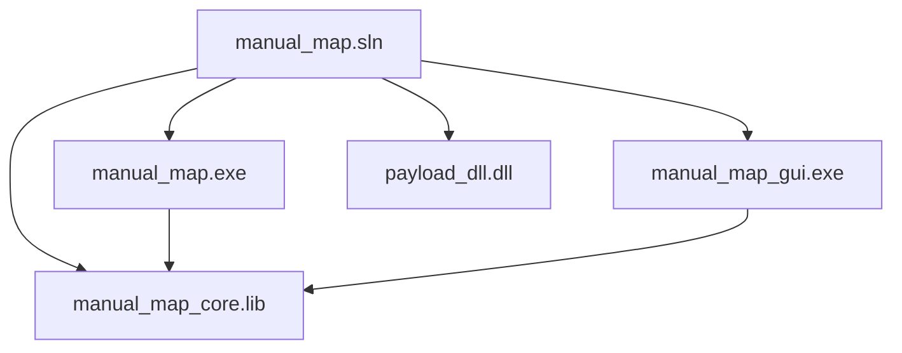

# Build and deployment

How to compile, locate outputs, run elevated, and use repository scripts.

---

## Prerequisites

| Requirement | Details |
|-------------|---------|
| Operating system | Windows 10 or 11 x64 |
| IDE | Visual Studio 2022 (v143 toolset) |
| Workload | Desktop development with C++ |
| Platform | **x64 only** (no Win32 target in solution) |
| SDK | Windows 10 SDK (10.0, as specified in vcxproj) |

---

## Solution structure

Open:

```
manual_map.sln
```

Projects:

| Project | vcxproj path | Output |
|---------|--------------|--------|
| manual_map_core | `manual_map/manual_map_core.vcxproj` | `manual_map_core.lib` |
| manual_map | `manual_map/manual_map.vcxproj` | `manual_map.exe` |
| manual_map_gui | `manual_map/manual_map_gui.vcxproj` | `manual_map_gui.exe` |
| payload_dll | `payload_dll/payload_dll.vcxproj` | `payload_dll.dll` |



---

## Build steps (Visual Studio)

1. Open `manual_map.sln`.
2. Set configuration to **Release** and platform to **x64**.
3. Build → Build Solution (or F7).
4. Confirm outputs under **`bin\Release\x64\`** at repository root.

### Command-line MSBuild

```powershell
& "${env:ProgramFiles}\Microsoft Visual Studio\2022\Community\MSBuild\Current\Bin\MSBuild.exe" `
  manual_map.sln /p:Configuration=Release /p:Platform=x64 /m
```

Individual project example:

```powershell
MSBuild.exe manual_map\manual_map_gui.vcxproj /p:Configuration=Release /p:Platform=x64
MSBuild.exe payload_dll\payload_dll.vcxproj /p:Configuration=Release /p:Platform=x64
```

---

## Output layout

After Release x64 build:

```
bin/Release/x64/
├── manual_map.exe
├── manual_map_gui.exe
├── payload_dll.dll
├── payload_dll.lib          # import library
├── manual_map_core.lib      # also under manual_map/bin depending on project output settings
└── (PDB files if generated)
```

GUI post-build may copy `app_icon.png` beside the executable.

**Note:** Close running `manual_map_gui.exe` before rebuilding the GUI to avoid linker file-lock errors (LNK1104).

---

## Running the application

### GUI (recommended)

```
bin\Release\x64\manual_map_gui.exe
```

- Right-click → **Run as administrator** when injecting protected processes.
- Or use **Run as Admin** inside the app.

### CLI

```
bin\Release\x64\manual_map.exe --list
bin\Release\x64\manual_map.exe --process notepad.exe --dll bin\Release\x64\payload_dll.dll
```

### Payload only

The reference payload must be built before inject tests:

```
bin\Release\x64\payload_dll.dll
```

---

## Scripts (`scripts/`)

| Script | Purpose |
|--------|---------|
| `commit.ps1` | Stage, commit with author metadata, optional push |
| `ensure-gui-not-running.ps1` | Stop GUI process before build |
| `reset-history.bat` | Batch helper for history reset (if configured) |

Example commit (project policy):

```powershell
.\scripts\commit.ps1 -StageAll -Push -Message "Your message here"
```

---

## Dependencies bundled

| Component | Location |
|-----------|----------|
| Dear ImGui | `manual_map/third_party/imgui/` |
| DirectX 11 | Windows SDK (GUI rendering) |

Do not modify ImGui for application behavior; wrap in `manual_map/src/gui/` instead.

---

## Debug vs Release

| Config | Notes |
|--------|-------|
| **Release** | Recommended; loader shellcode optimizations disabled per-file |
| **Debug** | Larger binaries, debug CRT; same x64 platform |

---

## Deployment checklist

1. Build Release x64 full solution.
2. Copy `bin\Release\x64\` trio: `manual_map_gui.exe`, `manual_map.exe`, `payload_dll.dll`.
3. Ensure VC++ runtime is available (Release uses `/MT` static CRT for payload; check GUI/core vcxproj for runtime setting).
4. Run GUI elevated when testing system processes.
5. Capture screenshots into `docs/images/` per [PLACEHOLDER.md](images/PLACEHOLDER.md).

---

## Troubleshooting

| Issue | Likely cause |
|-------|--------------|
| LNK1104 on GUI | EXE still running |
| Inject fails 0x1003 | Insufficient privileges; run as admin |
| No payload popup | `payload_silent=1` in settings; disable in Settings → Payload DLL |
| Handshake timeout | Target blocked thread creation; check loader log in output panel |
| Wrong architecture | Target must be x64 for x64 DLL |

---

## Related documents

- [README](../README.md) quick start
- [Architecture](architecture.md) module graph
- [CLI reference](cli-reference.md)
