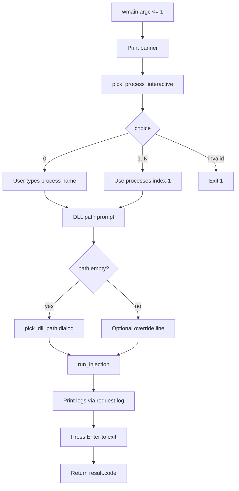

# CLI reference

`manual_map.exe` is the console front-end for the same injection engine used by the GUI. Source: `manual_map/src/cli/main.cpp`.

Build output: `bin\Release\x64\manual_map.exe`. Links `manual_map_core.lib` only (no ImGui).

See also: [Manual map engine](manual-map-engine.md), [Configuration reference](configuration-reference.md), [GUI application](gui-application.md), [Architecture](architecture.md).

---

## Usage

```
manual_map.exe [options]
```

With **no arguments**, the program enters **interactive mode**: numbered process list, user selects index, enters DLL path, then injects.

Short aliases exist for common flags (see table below).

---

## Options

| Flag | Alias | Argument | Description |
|------|-------|----------|-------------|
| `--process` | `-p` | Process name | Target by executable name (e.g. `notepad.exe`). Uses first match unless inject-all configured via settings |
| `--pid` | - | Decimal PID | Target specific process ID |
| `--dll` | `-d` | File path | Wide path to DLL to inject (required for inject) |
| `--list` | - | none | Print running processes and exit |
| `--search` | `-s` | Filter text | Used with `--list` to filter by name or PID substring |
| `--wait` | - | Seconds | Wait up to N seconds for `--process` to appear (converted to ms internally) |
| `--admin` | - | none | Relaunch self elevated with same arguments (excluding `--admin`) |
| `--gui` | - | none | Launch `manual_map_gui.exe` beside CLI directory |
| `--help` | `-h`, `/?` | none | Print help text and exit 0 |

**Parsing order:** Arguments processed left to right in `wmain`. `--search` before `--list` filters the list output.

**Default DLL in interactive mode:** `load_config` sets `request.dll_path = config.last_dll` before parsing.

---

## Examples

List all processes:

```
manual_map.exe --list
```

Filter and list:

```
manual_map.exe --list --search notepad
```

Inject by process name:

```
manual_map.exe --process notepad.exe --dll C:\path\payload_dll.dll
```

Inject by PID:

```
manual_map.exe --pid 12345 --dll payload_dll.dll
```

Wait for process then inject:

```
manual_map.exe --process notepad.exe --wait 30 --dll payload_dll.dll
```

Launch GUI:

```
manual_map.exe --gui
```

Elevate (restarts elevated process with remaining args):

```
manual_map.exe --admin --process notepad.exe --dll payload_dll.dll
```

---

## Interactive mode flow

**No screenshot provided** (optional asset 15). Terminal UI behavior:



### Process picker (`pick_process_interactive`)

1. Calls `list_processes()` from `process_list.cpp`.
2. Prints `0) Enter process name manually`.
3. Prints `1..N) [pid] name` for each entry.
4. Reads numeric choice from `std::wcin`.
5. Choice 0: prompts for name, leaves `out_pid = 0`.
6. Valid 1..N: sets `out_name` and `out_pid` from snapshot.

**Edge case:** Process list can change between display and inject; PID path is more stable.

### DLL path prompt

- If `request.dll_path` empty after picker: `pick_dll_path(config.last_dll)` (common dialog).
- If already set from config: prints path, Enter to keep or type new path.

### Elevation note

If not elevated, prints:

```
Note: not running as administrator. Injection may fail for some targets.
```

Does not auto-elevate (unlike `--admin` flag).

---

## `--list` output format

Function: `print_process_list` in `main.cpp`.

```
Running processes [matching "filter"]:

  PID       Name
  --------  ------------------------------
  1234      notepad.exe

Total: N
```

Uses `filter_processes(list_processes(), filter)`. Exits immediately with code 0 (does not inject).

---

## Configuration

CLI loads the same `%APPDATA%\manual_map\settings.ini` as the GUI via `load_config(config)` at startup.

Effects:

- **Safety rules** (allowlist/blocklist) apply to CLI injects via `run_injection`.
- **Recent DLL** and `last_dll` updated on success (`remember_dll`, `save_config`).
- Payload protocol flags apply when injecting payload-capable DLL.
- **`inject_all`:** Not exposed as CLI flag; controlled only via GUI-stored settings if wired in future. Currently CLI uses `request.inject_all` default false unless extended.

**Wait timeout:** `--wait SECONDS` sets `request.wait_for_ms = seconds * 1000`.

**Delay before inject:** Not exposed on CLI; use GUI settings profile or extend `inject_request` in code.

See [configuration-reference.md](configuration-reference.md).

---

## Exit codes

Returns **`inject_result.code`** from `run_injection` (0 = success) when not in pure help/list/gui/admin paths.

| Exit | Meaning |
|------|---------|
| 0 | Success, help, list, or gui launched |
| 1 | Interactive picker error, gui launch fail, admin relaunch fail, missing DLL/process |
| Non-zero hex | Inject failure (same as engine table) |

Common inject failures: [Manual map engine - Error code table](manual-map-engine.md#error-code-table-injector-side).

Interactive mode always waits for Enter before exit (even on failure) so user can read output.

---

## Relationship to GUI

| Feature | CLI | GUI |
|---------|-----|-----|
| Process pick | Interactive or flags | Search + table |
| Payload protocol | Via settings.ini | Settings + live toggles |
| History | Written to INI on success | History tab + INI |
| Log output | stdout via `std::wcout` | Output log panel |
| Worker thread | No (blocking inject) | Yes (`inject_worker`) |
| Multi-DLL queue | No | Yes |

The GUI executable path is resolved as `manual_map_gui.exe` in the same directory as `manual_map.exe` when using `--gui` (`launch_gui` replaces filename after last slash).

---

## Implementation notes

### Entry point

`wmain(int argc, wchar_t* argv[])` - Unicode CLI.

### Log callback

```cpp
request.log = [](const std::wstring& line) { std::wcout << line << L'\n'; };
```

All `run_injection` and mapper `[map]` lines go to stdout.

### UTF-8 helper

`to_wide(const std::string&)` used where needed for UTF-8 input conversion (CP_UTF8).

### Dependencies

- `#include <app/inject_service.hpp>` for `run_injection`
- `#include <app/process_list.hpp>` for list/wait
- `#include <app/config.hpp>` for settings
- No GUI headers

Does not start a separate worker thread (blocking inject in console process).

---

## How to modify the CLI

### Add a new flag

1. Parse in the `for (idx = 1; idx < argc)` loop in `wmain`.
2. Map to `inject_request` fields or local variables.
3. Update `print_help()` text.
4. Document in this file.

Example pattern for inject delay flag:

```cpp
if ( arg == L"--delay" && idx + 1 < argc ) {
    request.delay_ms = std::wcstoul( argv[++idx], nullptr, 10 ) * 1000u;
    continue;
}
```

### Embed CLI in automation

Call `manual_map.exe` with explicit `--process` / `--pid` and `--dll`. Check `%ERRORLEVEL%` in batch or `$LASTEXITCODE` in PowerShell.

For in-process automation, link core lib and call `run_injection` directly (see [Architecture](architecture.md)).

---

## Debugging CLI issues

| Issue | Action |
|-------|--------|
| Garbled Unicode paths | Ensure console UTF-8 (chcp 65001) or use ASCII paths |
| Exit code not propagated | Use non-interactive flags; interactive waits for Enter |
| `--admin` loop | UAC cancel returns exit 1 |
| List empty | Run as user with permission to snapshot processes |
| Wrong GUI launched | Verify `manual_map_gui.exe` adjacent to CLI exe |

Run from `bin\Release\x64\` so relative DLL paths resolve.

---

## Common failure modes

| Symptom | Cause | Fix |
|---------|-------|-----|
| Error: no process selected | Interactive choice invalid | Re-run with `--process` or `--pid` |
| Error: no DLL selected | Empty path and cancelled dialog | Pass `--dll` |
| Process blocked by safety rules | INI rules | Edit settings.ini or use GUI Safety |
| Exit 0x1003 | Not admin | `--admin` or elevate shell |
| GUI flag fails | GUI exe missing | Build full solution |

For engine internals see [manual-map-engine.md](manual-map-engine.md).
