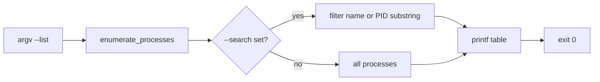
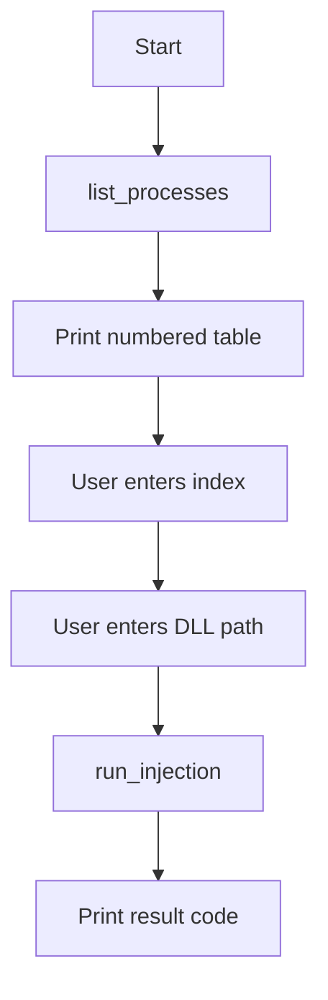

# CLI reference

`manual_map.exe` is the console front-end for the same injection engine used by the GUI. Source: `manual_map/src/cli/main.cpp`.

### Process list output (`--list`)

There is no bundled screenshot for CLI output. The feature works as follows: `manual_map.exe --list` enumerates processes via the same backend as the GUI (`process_list.cpp`), prints a fixed-width table to **stdout**, and exits with code `0`.

**Example session** (representative output; PIDs vary by machine):

```text
> manual_map.exe --list --search notepad

  PID      Process
  -------- --------------------
  18452    notepad.exe

> manual_map.exe --list

  PID      Process
  -------- --------------------
  1234     explorer.exe
  5678     notepad.exe
  ...
```



**Columns:** decimal PID, executable file name (not full path). Sort order matches internal list order (typically creation order from toolhelp snapshot).

**Filtering:** `--search notepad` matches case-insensitive substring in process name **or** PID string. Combine with `--list` only; other inject flags are ignored when listing.

**Scripting tip:** Pipe to `findstr` on Windows for further filtering:

```text
manual_map.exe --list | findstr /i notepad
```

**Failure modes:** If enumeration fails (rare), stderr may show an error and exit code is non-zero. Run elevated if you need processes visible only to admin.

*Optional screenshot: save terminal capture as `docs/images/15-cli-list-processes.png` if you want a PNG in docs.*

---

## Usage

```
manual_map.exe [options]
```

With **no arguments**, the program enters **interactive mode**: numbered process list, user selects index, enters DLL path, then injects.

---

## Options

| Flag | Argument | Description |
|------|----------|-------------|
| `--process` | Process name | Target by executable name (e.g. `notepad.exe`). Uses first match unless inject-all configured via settings |
| `--pid` | Decimal PID | Target specific process ID |
| `--dll` | File path | Wide path to DLL to inject (required for inject) |
| `--list` | none | Print running processes and exit |
| `--search` | Filter text | Used with `--list` to filter by name or PID |
| `--wait` | Seconds | Wait up to N seconds for `--process` to appear |
| `--admin` | none | Relaunch self elevated with same arguments |
| `--gui` | none | Launch `manual_map_gui.exe` beside CLI directory |
| `--help` | none | Print help text |

---

## Examples

List all processes:

```
manual_map.exe --list
```

Filter and list:

```
manual_map.exe --list --search notepad
```

Inject by process name:

```
manual_map.exe --process notepad.exe --dll C:\path\payload_dll.dll
```

Inject by PID:

```
manual_map.exe --pid 12345 --dll payload_dll.dll
```

Wait for process then inject:

```
manual_map.exe --process notepad.exe --wait 30 --dll payload_dll.dll
```

Launch GUI:

```
manual_map.exe --gui
```

Elevate:

```
manual_map.exe --admin --process notepad.exe --dll payload_dll.dll
```

---

## Interactive mode flow



Uses UTF-8 console where available (`to_wide` helper for paths).

---

## Configuration

CLI loads the same `%APPDATA%\manual_map\settings.ini` as the GUI via `load_config` before inject. That means:

- **Safety rules** (allowlist/blocklist) apply to CLI injects
- **Recent DLL** and history updates on success
- Payload protocol flags apply when injecting `payload_dll.dll`

See [configuration-reference.md](configuration-reference.md).

---

## Exit codes

Returns the **`inject_result.code`** from `run_injection` (0 success). Common values match [manual-map-engine.md](manual-map-engine.md) error table.

---

## Relationship to GUI

| Feature | CLI | GUI |
|---------|-----|-----|
| Process pick | Interactive or flags | Search + table |
| Payload protocol | Via settings.ini | Settings + live toggles |
| History | Written to INI | History tab + INI |
| Log output | stdout/stderr | Output log panel |

The GUI executable path is resolved as `manual_map_gui.exe` in the same directory as `manual_map.exe` when using `--gui`.

---

## Implementation notes

- Links only `manual_map_core.lib` (no ImGui).
- `#include <app/inject_service.hpp>` for `run_injection`.
- Does not start a separate worker thread (blocking inject in console process).

For engine internals see [manual-map-engine.md](manual-map-engine.md).
