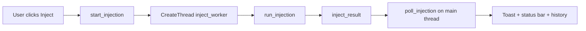

# GUI application reference

Every user-visible feature of `manual_map_gui.exe`, mapped to source files and behavior.

*Screenshot placeholder: Injection tab default layout.*

---

## Window shell (`gui_shell.cpp`)

The main window has **no native OS title bar**. Regions are stacked vertically:

| Region | Height source | Content |
|--------|---------------|---------|
| Title bar | `gui_theme_tokens.title_bar_height` | App icon, "Manual Map Injector", minimize / maximize / close |
| Tab bar | `tab_bar_height` | Injection, History, Settings |
| Main content | Remaining minus status | Active page renderer |
| Status bar | `status_bar_height` | Status text, target summary, Admin/Standard |

Horizontal **shell padding** insets tabs and main content from window edges. Status bar uses `ImGuiChildFlags_AlwaysUseWindowPadding` so left text is not flush with the border.

*Screenshot placeholder: bottom bar with Ready text, target, privilege label.*

### Title bar buttons

- **Minimize:** Normal minimize, or tray if **Minimize to tray** is enabled (`gui_tray.cpp`).
- **Maximize/restore:** Toggles `ShowWindow` SW_MAXIMIZE / SW_RESTORE.
- **Close:** Posts `WM_CLOSE`.

Title bar drag uses an invisible button over the caption area (`handle_title_drag`).

---

## Tab bar (`draw_tab_bar`)

Three custom ImGui buttons (not ImGui tab widgets):

1. **Injection** (`gui_page::injection`)
2. **History** (`gui_page::history`)
3. **Settings** (`gui_page::settings`)

Selected tab uses accent-muted background (fixed blue theme from `gui_theme.cpp`).

*Screenshot placeholder: tab row.*

---

## Injection tab (`draw_injection_page` in `gui_state.cpp`)

Layout: **left column** (target + payload) and **right column** (output log). Left column split ~62% target / 38% payload.

### Target panel (`LeftTargetPanel`)

| Control | Behavior |
|---------|----------|
| Search box | Filters process list by name or PID substring |
| Refresh | Calls `refresh_processes` |
| Sort combo | Name, PID, memory modes via `process_sort_mode` |
| Show process tree | Checkbox: flat list vs parent/child indent |
| Process list | Scrollable table; click selects PID; favorites via context |
| F5 | Global shortcut refreshes list |

*Screenshot placeholder: process list with search and sort.*

Keyboard in list: Up/Down moves `list_focus`.

### Payload panel (`LeftPayloadPanel`)

| Control | Behavior |
|---------|----------|
| Recent payloads | Quick-select chips with remove (X) |
| DLL path | Text field + **Browse** (`pick_dll_path`) |
| DLL queue | Optional multi-DLL queue with **Add**, sequential inject |
| PE line | Shows architecture and FNV hash from `analyze_pe_file` |
| Drag-and-drop | Window accepts `.dll`; sets path and `refresh_dll_pe` |

*Screenshot placeholder: payload path, recent DLL, PE hash.*

### Action row (uniform 136px buttons)

| Button | Action |
|--------|--------|
| **Inject** | `start_injection` → worker thread → `run_injection` |
| **Run as Admin** | `relaunch_as_admin` with current config |
| **Clear Log** | Clears `gui_app_state.log` |
| **Export Log** | Save dialog, writes log file |

Enter key on Injection tab also triggers inject (`gui_state_handle_shortcuts`).

### Output log (`draw_log_panel`)

| Control | Behavior |
|---------|----------|
| Filter | Substring filter on log lines |
| Copy Log | Clipboard |
| Jump to bottom | Sets `log_scroll_to_bottom`, enables tail follow |
| Auto tail | Follows new lines when user was already at bottom |

Colored lines by tag (inject, payload, errors). Monospace font when available.

*Screenshot placeholder: log toolbar and scrolled content.*

---

## History tab (`draw_history_page`)

Displays up to **20** entries from `config.injection_history` (newest first).

Each row shows:

- `[OK]` green or `[FAIL]` red
- Timestamp, target description, DLL path
- **Re-inject:** Copies DLL path, switches to Injection tab, starts inject

**Clear History** (top right, 120px button): Calls `clear_injection_history`, saves config, shows toast.

*Screenshot placeholder: history list with Clear History and Re-inject.*

---

## Settings tab (`draw_settings_page`)

Scrollable section cards (`gui_begin_section_card`) styled like the command palette: popup background, disabled header text, separator, inner padding.

### Appearance

- Light mode, Compact mode, Minimize to tray checkboxes
- Theme applies via `gui_theme_apply` / `gui_theme_init`

*Screenshot placeholder: Appearance section.*

### Capture

- **Stealth capture:** Hides GUI from screen capture via `SetWindowDisplayAffinity` (`window_stealth.cpp`)

*Screenshot placeholder: Capture section.*

### Injection

- Wait for process, inject all, auto-inject
- Delay seconds, watch folder path

*Screenshot placeholder: Injection settings section.*

### Logging

- Log timestamps toggle (affects `append_log` formatting)

### Safety

- Allowlist vs blocklist mode
- Multiline process rules (one name per line)

### Profiles

- Save current DLL/target/options as named profile
- Load / Delete per profile

### Payload DLL

Full toggle list for reference payload behavior (file log, IPC, hooks, hotkeys, overlay, etc.) plus paths and **Save payload settings**.

*Screenshot placeholder: Payload DLL section.*

### Advanced

- CLI notes field (passed to payload and logged on inject)
- Export / Import settings INI

### About

- Version blurb, Ctrl+K hint

---

## Overlays

### Command palette (`gui_draw_command_palette`)

Open with **Ctrl+K**. Modal with actions:

- Refresh process list
- Inject now
- Toggle light/dark
- Toggle stealth capture
- Go to Settings / History

*Screenshot placeholder: command palette modal.*

### First-run wizard (`gui_draw_first_run_wizard`)

Three steps: select DLL, choose process, ready to inject. Shown until `first_run_complete` in config.

*Screenshot placeholder: first-run wizard.*

### Drag overlay (`gui_draw_drag_overlay`)

Full-window tint and "Drop DLL here" while drag highlight timer active.

*Screenshot placeholder: drag-drop highlight.*

### Toasts (`gui_draw_toasts`)

Temporary bottom-right messages: info, success, error. Stored in `gui_app_state.toasts`.

---

## Keyboard shortcuts

| Shortcut | Action |
|----------|--------|
| F5 | Refresh process list |
| Ctrl+F | Focus process search (Injection tab) |
| Ctrl+L | Focus log filter |
| Ctrl+K | Open command palette |
| Enter | Inject (Injection tab, when not typing) |
| Up/Down | Move selection in process list when focused |

---

## Injection worker and feedback

- Success with payload handshake: status **Injection succeeded (payload verified)**
- Success without payload protocol: **Injection succeeded**
- Failure: hex code + `inject_error_message_w` in log

---

## Key source files

| File | Role |
|------|------|
| `gui_state.cpp` | Pages, inject worker, process table, settings, log |
| `gui_shell.cpp` | Chrome layout, status bar centering |
| `gui_widgets.cpp` | Shared controls, palette, wizard |
| `gui_theme.cpp` | Visual tokens |
| `gui_app.cpp` | Win32 integration |

For engine-side inject steps see [manual-map-engine.md](manual-map-engine.md). For payload popup and IPC see [payload-dll.md](payload-dll.md).
