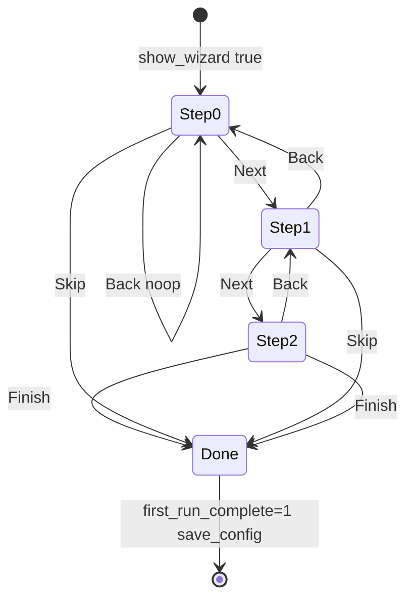
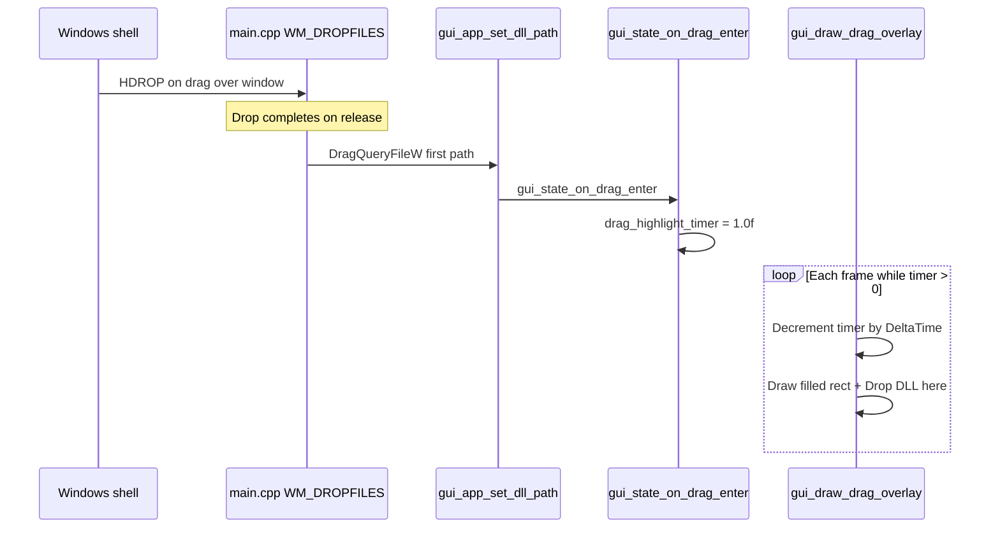
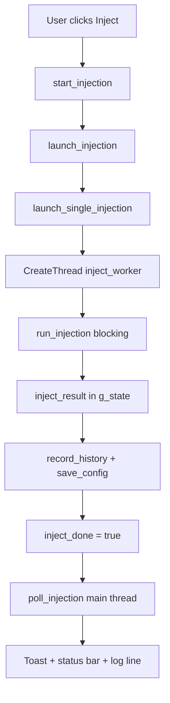

# GUI application reference

Every user-visible feature of `manual_map_gui.exe`, mapped to source files, function names, line-by-line behavior, edge cases, and troubleshooting.

Build output: `bin\Release\x64\manual_map_gui.exe`. Source root: `manual_map/src/gui/`.

See also: [Architecture](architecture.md), [Manual map engine](manual-map-engine.md), [Payload DLL](payload-dll.md), [Configuration reference](configuration-reference.md).

*Injection tab default layout: left column (target + payload), right column (output log), action row, status bar.*

---

## Process and entry point

| Step | File | Function | Behavior |
|------|------|----------|----------|
| WinMain | `manual_map/src/gui/main.cpp` | `wWinMain` | Registers window class, creates HWND, initializes DXGI + ImGui |
| Config load | `main.cpp` | (startup) | `load_config` into global `gui_app_state` |
| Frame loop | `main.cpp` | message loop | `PeekMessage`, `gui_state_new_frame`, `gui_state_render`, present |
| Shutdown | `main.cpp` | `WM_DESTROY` | `gui_tray_shutdown`, `PostQuitMessage` |

Window procedure highlights in `manual_map/src/gui/main.cpp`:

- **`WM_NCCALCSIZE`** - returns 0 to remove native client calc (borderless chrome).
- **`WM_NCHITTEST`** - delegates to `gui_shell_hit_test` for draggable title region vs client.
- **`WM_GETMINMAXINFO`** - minimum track size 800x500.
- **`WM_DROPFILES`** - `DragQueryFileW` first file, `gui_app_set_dll_path`, `gui_state_on_drag_enter` sets highlight timer.
- **`WM_SIZE`** - `gui_app_on_resize`, updates `window_maximized`, DWM corner preference.

---

## Window shell (`gui_shell.cpp`)

The main window has **no native OS title bar**. Regions are stacked vertically inside `gui_draw_shell` (or equivalent shell draw path):

| Region | Height source | Content |
|--------|---------------|---------|
| Title bar | `gui_theme_tokens.title_bar_height` | App icon, "Manual Map Injector", minimize / maximize / close |
| Tab bar | `tab_bar_height` | Injection, History, Settings |
| Main content | Remaining minus status | Active page renderer |
| Status bar | `status_bar_height` | Status text, target summary, Admin/Standard |

Horizontal **shell padding** insets tabs and main content from window edges. Status bar uses `ImGuiChildFlags_AlwaysUseWindowPadding` so left text is not flush with the border.

*Bottom bar: status string (Ready / Injecting / result), target summary, privilege label (Admin or Standard).*

### Title bar buttons

- **Minimize:** Normal minimize, or tray if **Minimize to tray** is enabled (`gui_tray.cpp`, config key `min_to_tray`).
- **Maximize/restore:** Toggles `ShowWindow` SW_MAXIMIZE / SW_RESTORE.
- **Close:** Posts `WM_CLOSE`.

Title bar drag uses an invisible button over the caption area (`handle_title_drag` in shell code). Dragging does not occur when clicking window control buttons.

### Status bar content

Updated from `gui_app_state.status` (string). After inject, `poll_injection` sets:

- Success + handshake: `"Injection succeeded (payload verified)"`
- Success only: `"Injection succeeded"`
- Failure: `"Injection failed (0x<code>)"`

Privilege label uses `is_process_elevated()` from `inject_service.hpp` (same helper as CLI).

---

## Tab bar (`draw_tab_bar` in `gui_state.cpp`)

Three custom ImGui buttons (not ImGui tab widgets):

1. **Injection** (`gui_page::injection`)
2. **History** (`gui_page::history`)
3. **Settings** (`gui_page::settings`)

Selected tab uses accent-muted background (fixed blue theme from `gui_theme.cpp`). Switching tabs does not reset inject state or process list cache.

*Title bar and tab row with Injection selected.*

---

## Injection tab (`draw_injection_page` in `gui_state.cpp`)

Layout: **left column** (target + payload) and **right column** (output log). Left column split ~62% target / 38% payload (derived from available height, not user-resizable split handle on left stack).

Panel split for log vs left column uses `config.panel_split` (default 0.42, meaning log takes ~42% width). Persisted in settings.ini.

### Target panel (`LeftTargetPanel`)

| Control | State field | Behavior |
|---------|-------------|----------|
| Search box | `state.search` | Filters process list by name or PID substring via `filter_processes` |
| Refresh | - | Calls `refresh_processes` which invokes `list_processes` and rebuilds `all_processes` |
| Sort combo | sort mode enum | Name, PID, memory modes via `process_sort_mode` |
| Show process tree | `config.show_process_tree` | Flat list vs parent/child indent in table |
| Process list | `selected_pid`, `list_focus` | Scrollable table; click selects PID; favorites via context menu |
| F5 | - | Global shortcut refreshes list (`gui_state_handle_shortcuts`) |

*Process list with search, sort combo, optional tree indent, favorite markers.*

**Keyboard in list:** Up/Down moves `list_focus` when list has focus.

**Edge cases:**

- Empty search with no selection: Inject logs "Search for a process and select it from the list".
- PID selected but process exited: inject may fail with `0x1000` or handle errors.
- Safety block: `is_process_allowed` checked in `launch_single_injection` before worker starts.
- WOW64 processes show in list; x64 inject into pure x86 targets will fail at PE validation.

**Process icons:** `gui_process_icons.cpp` caches HICON per executable path for list rows.

### Payload panel (`LeftPayloadPanel`)

| Control | State field | Behavior |
|---------|-------------|----------|
| Recent payloads | `config.recent_dlls` | Quick-select chips; X calls `remove_recent_dll` |
| DLL path | `state.dll_path` | Text field + **Browse** (`pick_dll_path` from `inject_service.cpp`) |
| DLL queue | `config.dll_queue` | Optional multi-DLL queue with **Add**, sequential inject via worker chain |
| PE line | PE analysis cache | Shows architecture and FNV hash from `analyze_pe_file` in `pe_util.cpp` |
| Drag-and-drop | - | Window accepts `.dll`; sets path and `refresh_dll_pe` |

*Payload path field, recent DLL chips, PE info line, Browse button.*

**`refresh_dll_pe`:** Reads path from `state.dll_path`, calls `analyze_pe_file`, updates display strings. Invalid path clears PE info.

**Queue inject:** When queue active, `launch_injection` sets `inject_queue_active`; worker on success advances `inject_queue_index` and spawns next `inject_worker` with next DLL path.

### Action row (uniform 136px buttons)

| Button | Function | Action |
|--------|----------|--------|
| **Inject** | `start_injection` | `launch_injection` then worker thread then `run_injection` |
| **Run as Admin** | `relaunch_as_admin` | ShellExecute `runas` with current executable |
| **Clear Log** | - | Clears `gui_app_state.log` under log mutex |
| **Export Log** | save dialog | Writes log text to user-chosen file |

Enter key on Injection tab also triggers inject (`gui_state_handle_shortcuts`) when no ImGui text input is active.

**Inject disabled visually** when `state.injecting` is true (atomic load).

### Output log (`draw_log_panel`)

| Control | Behavior |
|---------|----------|
| Filter | Substring filter on log lines (case-sensitive UTF-8 match in UI) |
| Copy Log | Full unfiltered log to clipboard |
| Jump to bottom | Sets `log_scroll_to_bottom`, enables tail follow |
| Auto tail | Follows new lines when user was already at bottom |

Colored lines by tag prefix: `[inject]`, `[payload]`, `[cli]`, errors. Monospace font when available from theme.

*Log toolbar and scrolled content with colored tags.*

**Timestamps:** When `config.log_timestamps` is true, `append_log` prefixes local time before each line.

---

## History tab (`draw_history_page`)

Displays up to **20** entries from `config.injection_history` (newest first). Entries added in `record_history` from inject worker after each attempt.

Each row shows:

- `[OK]` green or `[FAIL]` red
- Timestamp, target description, DLL path
- **Re-inject:** Copies DLL path, switches to Injection tab, calls `start_injection`

**Clear History** (top right, 120px button): Calls `clear_injection_history`, `save_config`, shows toast.

*History list with Clear History and per-row Re-inject.*

**Edge case:** Re-inject does not restore previous PID if process exited; user may need to re-select target.

---

## Settings tab (`draw_settings_page`)

Scrollable section cards (`gui_begin_section_card` in `gui_widgets.cpp`) styled like the command palette: popup background, disabled header text, separator, inner padding.

Section open/closed state persisted per `settings_*_open` keys in config.

### Appearance

- Light mode (`light_mode`), Compact mode (`compact_mode`), Minimize to tray (`min_to_tray`)
- Theme applies via `gui_theme_apply` / `gui_theme_init` on toggle

### Capture

- **Stealth capture:** Hides GUI from screen capture via `SetWindowDisplayAffinity` in `window_stealth.cpp` when `stealth_capture` is true

### Injection

- Wait for process (`wait_for_process` behavior via profile/inject options)
- Inject all matching instances (`inject_all`)
- Auto-inject when search name appears (`auto_inject`, polled in `poll_auto_inject`)
- Delay seconds (converted to ms in inject request)
- Watch folder path (`watch_folder`, polled in `poll_watch_folder` every 0.5s)

**Auto-inject:** Requires non-empty search string and DLL path; triggers once per new PID match (`last_auto_inject_pid` dedupes).

**Watch folder:** Picks newest `.dll` by `last_write_time`; updates path and may auto-inject if configured.

### Logging

- Log timestamps toggle (affects `append_log` formatting)

### Safety

- Allowlist vs blocklist mode (`use_allowlist`)
- Multiline process rules (one name per line, stored as repeated `process_rule` keys)

Matching is exact case-insensitive (`_wcsicmp`) on executable name, not wildcard. See [Configuration reference - Safety](configuration-reference.md#safety).

### Profiles

- Save current DLL/target/options as named profile (`inject_profile` struct)
- Load / Delete per profile from in-memory vector, persisted as repeated INI blocks

### Payload DLL

Full toggle list for reference payload behavior (file log, IPC, hooks, hotkeys, overlay, etc.) plus paths and **Save payload settings** button (calls `save_config`).

Maps to `build_payload_config` in `payload_bridge.cpp`. See [Payload DLL](payload-dll.md).

### Advanced

- CLI notes field (`cli_notes`, passed to payload and logged on inject)
- Export / Import settings INI via `save_config_to_path` / `load_config_from_path`

### About

- Version blurb, Ctrl+K hint for command palette

---

## Overlays

Overlays draw after main page content in `gui_state_render` (order: command palette, first-run wizard, drag overlay, toasts).

### Command palette (`gui_draw_command_palette` in `gui_widgets.cpp`)

Open with **Ctrl+K**. Modal popup with filtered action list.

Typical actions:

- Refresh process list
- Inject now
- Toggle light/dark
- Toggle stealth capture
- Go to Settings / History

*Modal command palette centered over main window.*

Implementation: sets `state.command_palette_open`, uses `ImGui::BeginPopupModal`, closes on action or Escape.

### First-run wizard (`gui_draw_first_run_wizard` in `gui_widgets.cpp`)

Shown when `state.show_wizard` is true, normally because `config.first_run_complete` is false on first launch.

**No screenshot provided** (optional asset 14). Behavior documented below.

| Step | `wizard_step` | UI text | User action expected |
|------|---------------|---------|----------------------|
| 1 | 0 | Select DLL payload | Browse or drag-drop `.dll` onto window |
| 2 | 1 | Choose target process | Search list, click row, optional favorite |
| 3 | 2 | Ready to inject | Press Inject or Enter |

**Modal properties:** `FirstRunWizard` popup, 480x260, centered, `ImGuiWindowFlags_NoResize`.

**Buttons:**

- **Back** - visible when `wizard_step > 0`, decrements step.
- **Next** - visible when `wizard_step < 2`, increments step.
- **Skip** (steps 0-1) or **Finish** (step 2) - sets `show_wizard = false`, `first_run_complete = true`, `save_config`, closes popup.

**How to modify:** Edit copy and steps in `gui_draw_first_run_wizard` in `manual_map/src/gui/gui_widgets.cpp`. To force wizard again for testing, set `first_run_complete=0` in settings.ini.

**Debugging:** If wizard blocks interaction, check `ImGui::OpenPopup("FirstRunWizard")` is paired with `BeginPopupModal`. Verify `state.show_wizard` cleared on Finish.

### Drag overlay (`gui_draw_drag_overlay` in `gui_widgets.cpp`)

**No screenshot provided** (optional asset 16). Full-window visual feedback while dragging a file over the HWND.

**Trigger on drop (not hover):** `WM_DROPFILES` in `manual_map/src/gui/main.cpp` calls `gui_state_on_drag_enter` which sets `drag_highlight_timer = 1.0f` in `gui_state.cpp`. The overlay decays over ~1 second for visual confirmation after drop.

**Rendering:** Foreground draw list full-screen tint (accent color, alpha 0.18 * fade), centered white text `"Drop DLL here"`.

**Requirements:** Window must register with `DragAcceptFiles` during creation (`gui_app.cpp`). Only first dropped file is used.

**Edge cases:**

- Non-DLL extension still sets path; PE line may fail on refresh.
- Drop while inject running: path updates but does not cancel inject.

### Toasts (`gui_draw_toasts`)

Temporary bottom-right messages: info, success, error. Stored in `gui_app_state.toasts` vector with expiry timers. Pushed from `gui_push_toast` on inject result, history clear, etc.

---

## Keyboard shortcuts

| Shortcut | Handler | Action |
|----------|---------|--------|
| F5 | `gui_state_handle_shortcuts` | Refresh process list |
| Ctrl+F | same | Focus process search (Injection tab) |
| Ctrl+L | same | Focus log filter |
| Ctrl+K | same | Open command palette |
| Enter | same | Inject (Injection tab, when not typing in input) |
| Up/Down | process list focus | Move selection in process list |

Shortcuts processed in `gui_state_handle_shortcuts` before page draw when ImGui wants keyboard unless text input active.

---

## Injection worker and feedback

**Worker struct** (`inject_worker_context` in `gui_state.cpp`):

- `gui_app_state* state`
- `inject_request request` (log callback captures state for `append_log`)
- `history_target`, `history_dll` strings for history entry

**Log callback:** Worker uses `request.log` wired to append to output panel with UTF-8 conversion.

**Queue continuation:** If `inject_queue_active` and more DLLs remain, worker increments index and calls `launch_single_injection` for next path without clearing `injecting`.

**Main thread poll** (`poll_injection`):

- While injecting, animates `inject_progress` up to 0.92.
- When `inject_done`, reads `inject_result`, updates status, toast, log.

---

## Key source files

| File | Role |
|------|------|
| `manual_map/src/gui/gui_state.cpp` | Pages, inject worker, process table, settings, log, polls |
| `manual_map/src/gui/gui_shell.cpp` | Chrome layout, status bar, hit test |
| `manual_map/src/gui/gui_widgets.cpp` | Shared controls, palette, wizard, drag overlay, toasts |
| `manual_map/src/gui/gui_theme.cpp` | Visual tokens, accent color |
| `manual_map/src/gui/gui_app.cpp` | Win32 window, D3D11 swap chain, drag accept |
| `manual_map/src/gui/main.cpp` | Entry, WndProc, drop files |
| `manual_map/src/gui/window_stealth.cpp` | Display affinity stealth |
| `manual_map/src/gui/gui_tray.cpp` | Tray icon and minimize |

---

## How to modify the GUI

### Add a new tab

1. Add enum value to `gui_page` in `gui_state.hpp`.
2. Add button in `draw_tab_bar`.
3. Add case in main content switch to call new `draw_*_page`.
4. Document in this file and [INDEX.md](INDEX.md).

### Add an injection shortcut

Extend `gui_state_handle_shortcuts`. Check `state.page == gui_page::injection` and `!ImGui::GetIO().WantCaptureKeyboard` for global keys.

### Change inject worker behavior

Prefer modifying `run_injection` in core rather than duplicating logic in `inject_worker`. GUI should only build `inject_request` and display `inject_result`.

---

## Debugging the GUI

| Issue | Check |
|-------|-------|
| Blank window | D3D11 device init in `gui_app.cpp`, debug layer output |
| Drop has no effect | `DragAcceptFiles`, `WM_DROPFILES` path, extension |
| UI frozen during inject | Worker must run `run_injection`; never call inject on main thread |
| Settings not saved | `save_config` after change; file lock under `%APPDATA%` |
| Stealth still captured | `SetWindowDisplayAffinity` requires Windows 10 2004+; some tools bypass |
| Wizard every launch | `first_run_complete` not persisting |

Use Visual Studio attach to `manual_map_gui.exe`. Breakpoints: `launch_injection`, `inject_worker`, `poll_injection`.

---

## Common failure modes (GUI-specific)

| Symptom | Cause | Fix |
|---------|-------|-----|
| Inject button appears no-op | No target selected | Select row or type process name in search |
| "Process blocked by safety rules" | Blocklist/allowlist | Settings - Safety |
| Progress stuck at 92% | Worker hung in mapper | Check target permissions, see engine error when done |
| Re-inject wrong DLL | History stores path at inject time | Verify history row DLL column |
| Tray minimize lost window | Close restores from tray icon | `gui_tray.cpp` NOTIFYICON |

For engine-side inject steps see [manual-map-engine.md](manual-map-engine.md). For payload popup and IPC see [payload-dll.md](payload-dll.md).
