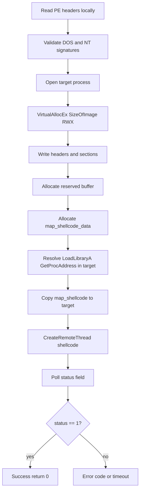
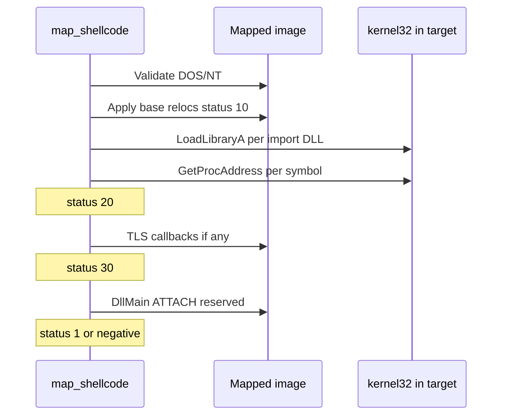

# Manual map engine

Technical reference for `c_manual_map` in `manual_map/src/manual_map/manual_map.cpp` and the in-process loader in `manual_map/src/manual_map/loader_shellcode.cpp`.

See also: [Architecture](architecture.md), [Payload DLL](payload-dll.md), [CLI reference](cli-reference.md), [GUI application](gui-application.md).

---

## Public API (`manual_map/include/manual_map/manual_map.hpp`)

```cpp
class c_manual_map {
public:
    uint32_t inject(const wchar_t* process_name, uint8_t* data, size_t size,
                    void* reserved, size_t reserved_size, manual_map_options options);
    uint32_t inject_pid(uint32_t pid, uint8_t* data, size_t size,
                        void* reserved, size_t reserved_size, manual_map_options options);
};
```

### Parameters

| Parameter | Type | Meaning |
|-----------|------|---------|
| `data` / `size` | `uint8_t*`, `size_t` | Raw PE file bytes (DLL as read from disk). Not loaded via `LoadLibrary` in injector. |
| `reserved` / `reserved_size` | `void*`, `size_t` | Optional buffer copied into target and passed to `DllMain` as `lpReserved`. When null, a small `map_reserved_data` struct is allocated instead (module base + size). |
| `options.log` | `std::function<void(const std::wstring&)>` | Optional wide-string callback for verbose mapper log lines (`[map]`, `[loader]`, `[handle]`, etc.). |

### Return value

**0** means success. Non-zero codes are documented below and in `manual_map/src/app/errors.cpp` (`inject_error_message`).

---

## High-level mapping pipeline



Entry points:

- `inject(process_name, ...)` - resolves PID via `find_pid` (NtQuerySystemInformation), then `map_image`.
- `inject_pid(pid, ...)` - sets `m_pid`, calls `map_image`.

---

## `map_image` steps (injector process)

Implementation: `c_manual_map::map_image` in `manual_map/src/manual_map/manual_map.cpp`.

### 1. Parse and validate PE (local buffer)

- Read `IMAGE_DOS_HEADER` at offset 0. Fail **`0x1001`** if `e_magic != IMAGE_DOS_SIGNATURE`.
- Read `IMAGE_NT_HEADERS` at `data + e_lfanew`. Fail **`0x1002`** if `Signature != IMAGE_NT_SIGNATURE`.
- Log SizeOfImage, EntryPoint RVA, preferred ImageBase, section count.

**Edge case:** Truncated file on disk may pass initial read in `inject_service` but fail here if headers incomplete.

### 2. Acquire process handle

- Call `enable_debug_privilege()` (`AdjustTokenPrivileges` for `SeDebugPrivilege`).
- Try `OpenProcess` with `PROCESS_VM_OPERATION | PROCESS_VM_READ | PROCESS_VM_WRITE | PROCESS_QUERY_INFORMATION | PROCESS_CREATE_THREAD`.
- On failure, call `hijack_handle(target_pid, same access)`.

Fail **`0x1003`** if both paths return null.

#### Handle hijack algorithm (`hijack_handle`)

1. Resolve `NtDuplicateObject` from ntdll.
2. Query system handle information (class 64, `SystemExtendedHandleInformation` style layout in code).
3. **Pass 0:** only consider handles owned by `csrss.exe`.
4. **Pass 1:** consider handles owned by any process except self and target.
5. For each candidate: `OpenProcess(PROCESS_DUP_HANDLE)` on owner, duplicate handle into injector, verify `GetProcessId(duped) == target_pid`.

**Debugging 0x1003:** Run injector elevated. Protected processes (PPL) may block both direct open and hijack.

### 3. Allocate image memory in target

- `VirtualAllocEx` size `OptionalHeader.SizeOfImage`, protection `PAGE_EXECUTE_READWRITE`.
- Fail **`0x1005`** on null return.

**Note:** Entire image is RWX initially; section characteristics are not applied as separate protections in current code.

### 4. Write PE image

- Write headers: `SizeOfHeaders` bytes to `image_base`.
- For each section in `IMAGE_FIRST_SECTION`:
  - Write `SizeOfRawData` from `PointerToRawData` to `VirtualAddress`.
  - Zero-fill if `VirtualSize > SizeOfRawData` (bss tail).
- Fail **`0x1006`** on any partial `WriteProcessMemory`.

Logs per section: name, VA, VSize, RawSize, characteristics.

### 5. Reserved buffer for DllMain

**If caller supplied `reserved` and `reserved_size`:**

- Allocate `reserved_size` bytes RW in target.
- Write caller buffer (e.g. packed `payload_config`).
- Fail **`0x1008`** if allocation fails.

**Else:**

- Allocate `sizeof(map_reserved_data)`.
- Fill `{ module_base, module_size }`.
- Write to target. Same fail code.

Payload inject path uses caller buffer from `inject_service.cpp` (`prepare_payload_session`).

### 6. Shellcode data block (`map_shellcode_data`)

Allocate RW struct in target containing:

| Field | Value |
|-------|--------|
| `module_base` | Remote image base |
| `reserved_data` | Remote reserved buffer pointer |
| `status` | Volatile LONG, initially 0 |
| `load_library` | Remote address of `LoadLibraryA` |
| `get_proc_address` | Remote address of `GetProcAddress` |

Resolve exports via `resolve_remote_export`:

- Compare local and remote module base for `kernelbase.dll` / `kernel32.dll`.
- Compute remote export as `remote_module + (local_export - local_module)`.

Fail **`0x1019`** if either function pointer null.

Fail **`0x1012`** if data allocation fails.

### 7. Loader code allocation

- Size from `map_shellcode_size()` (end - start of `map_shellcode` in `.loader` section).
- Allocate RWX in target, write shellcode bytes.
- Fail **`0x1014`** on allocation or write failure.

### 8. Run loader (`run_loader`)

- `CreateRemoteThread(process, start=shellcode_addr, param=shellcode_data_addr)`.
- Fail **`0x1018`** if thread creation fails.

**Poll loop** (default timeout 10000 ms in call site):

- Every 50 ms: read remote `status` field at offset in `map_shellcode_data`.
- Log on status change using `loader_status_text`.
- Success when `status == 1` or `status >= 30` (DllMain phase entered).
- Failure when `status < 0`: map to `0x101A0000 | abs(status)`.
- Timeout: **`0x1017`** if thread completes without success status.

### 9. Cleanup (`cleanup` label)

On failure, free remote allocations: image, reserved, shellcode data, shellcode. Close process handle.

On success, remote memory is intentionally left allocated (mapped DLL stays in target).

Logging prefix examples: `[map]`, `[loader]`, `[inject]`, `[handle]`, `[imports]`, `[pe]`.

---

## In-process loader (`map_shellcode`)

Runs **inside the target process** on a dedicated remote thread. Does not return until mapping completes or fails.

Source: `manual_map/src/manual_map/loader_shellcode.cpp`, function `map_shellcode(map_shellcode_data* data)`.

Compiled with:

- `#pragma code_seg(".loader", read)`
- `#pragma optimize("", off)`
- `#pragma runtime_checks("", off)`
- Release vcxproj: optimizations disabled for this file, `BufferSecurityCheck` false

### Status progression

| Status | Meaning |
|--------|---------|
| `10` | Base relocations applied |
| `20` | Import directory resolved |
| `30` | TLS callbacks executed, about to call DllMain |
| `1` | **Success** (DllMain returned TRUE) |
| `-1` | Invalid DOS signature |
| `-2` | Invalid NT signature |
| `-3` | `LoadLibrary` failed for a dependency |
| `-4` | `GetProcAddress` failed for an import |
| `-5` | `DllMain` returned FALSE |

Injector maps loader failures in range `-1`..`-5` to `0x101A0000 | abs(status)` for unified error reporting via `inject_error_message`.

### Algorithm (line-by-line summary)

1. **Validate headers** at `data->module_base` (same checks as injector). Set `-1` / `-2` on failure.
2. **Compute delta** = mapped base - preferred ImageBase.
3. **Base relocations** if `IMAGE_DIRECTORY_ENTRY_BASERELOC` present:
   - Walk `IMAGE_BASE_RELOCATION` blocks.
   - Apply `IMAGE_REL_BASED_DIR64` and `IMAGE_REL_BASED_HIGHLOW` entries.
   - Set status **10**.
4. **Imports** if import directory present:
   - For each `IMAGE_IMPORT_DESCRIPTOR`, `load_library(module_name)`.
   - Resolve thunks (ordinal or by name) via `get_proc_address`.
   - Write resolved addresses into FirstThunk.
   - Set **-3** / **-4** on failure.
   - Set status **20**.
5. **TLS callbacks** if TLS directory present:
   - Adjust callback pointers for delta.
   - Invoke each `PIMAGE_TLS_CALLBACK` with `(DLL_PROCESS_ATTACH, reserved)`.
6. Set status **30**.
7. **Entry point:** call as `BOOL WINAPI DllMain(image_base, DLL_PROCESS_ATTACH, reserved_data)`.
8. If FALSE, status **-5**. Else status **1**.



**Edge cases:**

- No relocations when delta is 0: reloc block skipped, status still reaches 10 after empty reloc dir handling.
- Delay-load imports are **not** handled (only standard import directory).
- Bound imports are not special-cased.

---

## Handle and thread strategy

| Mechanism | Function | When used |
|-----------|----------|-----------|
| SeDebugPrivilege | `enable_debug_privilege` | Before every open/hijack attempt |
| Direct open | `OpenProcess` | First try in `map_image` |
| Handle hijack | `hijack_handle` | When OpenProcess fails |
| Remote thread | `CreateRemoteThread` | Execute `map_shellcode` |

There is **no thread hijack** in current code despite error message `0x1004` ("Failed to find or hijack a suitable thread") reserved in `errors.cpp` for legacy/alternate paths. Active failure for thread start is **`0x1018`**.

---

## `inject_service` integration

`run_injection` in `manual_map/src/app/inject_service.cpp`:

1. Validates DLL path, optional delay sleep.
2. Reads file via `read_file_bytes`.
3. For each target PID, calls `prepare_payload_session` when DLL supports payload protocol.
4. Passes `&session.config` as `reserved` when enabled (sizeof `payload_config`).
5. On success, `verify_payload_handshake` (8000 ms) and optional IPC ping.

The mapper does not know about payload protocol except via opaque `reserved` bytes.

---

## Error code table (injector-side)

| Code | Message | Typical cause |
|------|---------|---------------|
| `0x1000` | Target process not found | Wrong name/PID, process exited |
| `0x1001` | Invalid DOS signature | Corrupt file or non-PE (also service: empty DLL path/read fail) |
| `0x1002` | Invalid NT signature | Truncated PE |
| `0x1003` | Failed to acquire target process handle | Permissions, protected process |
| `0x1004` | Failed to find or hijack suitable thread | Reserved message |
| `0x1005` | Failed to allocate memory for mapped image | Target memory pressure |
| `0x1006` | Failed to write PE data | Handle lacks VM_WRITE |
| `0x1008` | Failed to allocate reserved data | Remote alloc failure |
| `0x1012` | Failed to allocate shellcode data | Remote alloc failure |
| `0x1014` | Failed to allocate or copy loader shellcode | Remote alloc/write failure |
| `0x1016` | Failed to allocate execution stub | Reserved |
| `0x1017` | Loader timed out | DllMain hang, deadlock in init |
| `0x1018` | Failed to create remote loader thread | Anti-cheat, policy |
| `0x1019` | Failed to resolve loader imports in target | kernel32 not loaded as expected |
| `0x1020` | Timed out waiting for process | `--wait` / GUI wait mode |
| `0x101A0001`..`0005` | Loader negative status | See status table above |

Lookup helpers: `inject_error_message`, `inject_error_message_w` in `manual_map/src/app/errors.cpp`.

---

## Build notes for loader object file

`loader_shellcode.cpp` must remain position-independent:

- No static CRT calls inside `map_shellcode`.
- Only uses pointers from `map_shellcode_data` and PE structures.
- Section name `.loader` must match vcxproj linker settings if customized.

`map_shellcode_size()` returns `map_shellcode_end - map_shellcode` or fallback `0x2000`.

---

## How to modify the loader

1. Edit `map_shellcode` in `manual_map/src/manual_map/loader_shellcode.cpp`.
2. Keep all code in `.loader` section; no external C++ helpers linked into shellcode.
3. If adding new status codes, update:
   - `loader_status_text` in `manual_map.cpp`
   - `inject_error_message` in `errors.cpp`
   - This documentation
4. Rebuild **Release x64** and test against `payload_dll.dll` with MessageBox enabled.
5. Compare shellcode size before/after (`map_shellcode_size()` log in verbose mode).

**Do not** enable optimizations for `loader_shellcode.cpp` in Release.

### Adding section protection

Current code maps one RWX region. To apply per-section `VirtualProtectEx`, add loop after section writes in `map_image` before starting loader, using `IMAGE_SECTION_HEADER.Characteristics`.

---

## Debugging the engine

| Technique | Action |
|-----------|--------|
| Verbose logs | Set `manual_map_options.log` or GUI inject log callback |
| Status polling | Watch for `[loader] Status ->` lines (10, 20, 30, 1) |
| Remote debugger | Attach to target before inject; break on DllMain |
| Loader hang | Status stuck at 30: DllMain blocked; timeout 0x1017 |
| Import failure | Status -3: missing VC runtime DLL in target; -4: wrong arch export |

**Common mistake:** Passing stack pointer as `reserved` from injector without copying to target. Correct pattern: allocate remote buffer and write bytes (already done in `map_image`).

---

## Common failure modes

| Scenario | Code | Resolution |
|----------|------|------------|
| Injector not admin | 0x1003 | Elevate GUI/CLI |
| Target is WoW64 from x64 injector | varies | Use x64 target process |
| DLL is x86 | PE check may fail early | Build x64 payload |
| DllMain throws / hangs | 0x1017 | Fix payload init; use delayed init |
| Double inject same DLL | Undefined | New alloc each inject (no dedup) |

---

## Related reading

- [Architecture](architecture.md) for module graph
- [Payload DLL](payload-dll.md) for `reserved` / `payload_config` usage
- [CLI reference](cli-reference.md) for non-GUI inject path
- [Configuration reference](configuration-reference.md) for wait/delay settings
