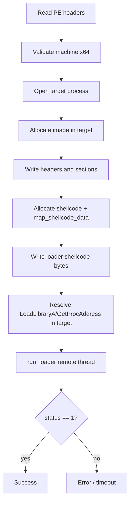
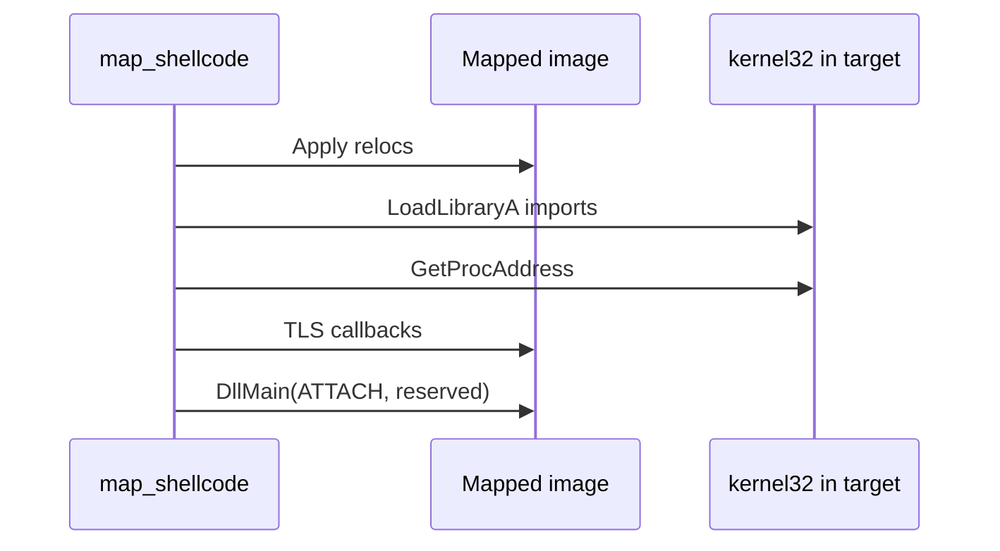

# Manual map engine

Technical reference for `c_manual_map` in `manual_map/src/manual_map/manual_map.cpp` and the in-process loader in `loader_shellcode.cpp`.

---

## Public API (`manual_map/include/manual_map/manual_map.hpp`)

```cpp
class c_manual_map {
public:
    uint32_t inject(const wchar_t* process_name, uint8_t* data, size_t size,
                    void* reserved, size_t reserved_size, manual_map_options options);
    uint32_t inject_pid(uint32_t pid, uint8_t* data, size_t size,
                        void* reserved, size_t reserved_size, manual_map_options options);
};
```

- **`data` / `size`:** Raw PE file bytes (DLL on disk).
- **`reserved` / `reserved_size`:** Optional buffer copied into target and passed to `DllMain` as `lpReserved`. When null, a small `map_reserved_data` struct is allocated instead (module base + size).
- **`options.log`:** Optional wide-string callback for verbose mapper log lines.

Return value **0** means success. Non-zero codes are documented in [errors.cpp](../manual_map/src/app/errors.cpp) and below.

---

## High-level mapping pipeline



---

## `map_image` steps (injector process)

1. **Parse DOS/NT headers** from local buffer. Fail `0x1001` / `0x1002` if invalid.
2. **Open process** (`OpenProcess` or handle hijack). Fail `0x1003` if unavailable.
3. **Allocate** image-sized region in target (`VirtualAllocEx`). Fail `0x1005` on allocation failure.
4. **Write** PE headers and each section to mapped virtual addresses. Fail `0x1006` on partial write.
5. **Reserved buffer:** If caller supplied `reserved`, allocate and write that many bytes. Else allocate `map_reserved_data` with image base and size.
6. **Shellcode data:** Allocate `map_shellcode_data` containing:
   - `module_base`
   - `reserved_data` pointer
   - `status` (volatile LONG, initially 0)
   - Function pointers to target's `LoadLibraryA` and `GetProcAddress`
7. **Loader code:** Allocate RWX (or RW then RX), copy `map_shellcode` bytes from `.loader` section.
8. **Execution stub:** Small trampoline if needed, then `run_loader`.
9. **Poll** remote thread and `status` field until success, failure, or timeout (`0x1017`).
10. **Cleanup** remote allocations on failure paths.

Logging prefix examples: `[map]`, `[loader]`, `[inject]`.

---

## In-process loader (`map_shellcode`)

Runs **inside the target process** on a dedicated thread. Does not return until mapping completes or fails.

### Status progression

| Status | Meaning |
|--------|---------|
| `10` | Base relocations applied |
| `20` | Import directory resolved |
| `30` | TLS callbacks executed, about to call DllMain |
| `1` | **Success** (DllMain returned TRUE) |
| `-1` | Invalid DOS signature |
| `-2` | Invalid NT signature |
| `-3` | `LoadLibrary` failed for a dependency |
| `-4` | `GetProcAddress` failed for an import |
| `-5` | `DllMain` returned FALSE |

Injector maps loader failures in range `-1`..`-5` to `0x101A0000 | abs(status)` for unified error reporting.

### Algorithm (per `loader_shellcode.cpp`)

1. Validate DOS and NT headers at `module_base`.
2. Apply **base relocations** if image base differs from preferred.
3. Walk **import directory**: for each DLL, `load_library`, resolve thunks via `get_proc_address`.
4. Run **TLS callbacks** if present (`IMAGE_DIRECTORY_ENTRY_TLS`).
5. Set status `30`, invoke **entry point** as `DllMain(image_base, DLL_PROCESS_ATTACH, reserved_data)`.
6. Set status `1` on success.



---

## Handle and thread strategy

`c_manual_map` attempts to gain sufficient access to the target process and start loader execution:

- Enables **SeDebugPrivilege** when possible.
- May **duplicate handles** from other processes (`NtDuplicateObject`) to obtain PROCESS_VM_OPERATION | PROCESS_VM_WRITE | PROCESS_CREATE_THREAD.
- Uses **thread hijack** or remote thread creation (implementation in `manual_map.cpp`) to run shellcode with a timeout (poll loop in `run_loader`).

Failure codes include `0x1004` (thread), `0x1018` (remote thread creation), `0x1019` (resolve loader imports in target).

---

## `inject_service` integration

`run_injection` in `inject_service.cpp`:

1. Validates DLL path, optional delay sleep.
2. Reads file via `read_file_bytes`.
3. For each target PID, calls `prepare_payload_session` when DLL supports payload protocol.
4. Passes `&session.config` as `reserved` when enabled.
5. On success, `verify_payload_handshake` and optional IPC ping.

---

## Error code table (injector-side)

| Code | Message |
|------|---------|
| `0x1000` | Target process not found |
| `0x1001` | Invalid DOS signature |
| `0x1002` | Invalid NT signature |
| `0x1003` | Failed to acquire target process handle |
| `0x1004` | Failed to find or hijack suitable thread |
| `0x1005` | Failed to allocate memory for mapped image |
| `0x1006` | Failed to write PE data |
| `0x1008` | Failed to allocate reserved data |
| `0x1012` | Failed to allocate shellcode data |
| `0x1014` | Failed to allocate or copy loader shellcode |
| `0x1016` | Failed to allocate execution stub |
| `0x1017` | Loader timed out |
| `0x1018` | Failed to create remote loader thread |
| `0x1019` | Failed to resolve loader imports in target |
| `0x1020` | Timed out waiting for process (wait mode) |
| `0x101A0001`..`0005` | Loader negative status as above |

---

## Build notes for loader object file

`loader_shellcode.cpp` is compiled with:

- `#pragma code_seg(".loader")`
- Optimizations disabled for Release in vcxproj
- `BufferSecurityCheck` off

This keeps the shellcode blob stable and extractable via `map_shellcode_size()`.

---

## Related reading

- [Architecture](architecture.md) for module graph
- [Payload DLL](payload-dll.md) for `reserved` / `payload_config` usage
- [CLI reference](cli-reference.md) for non-GUI inject path
