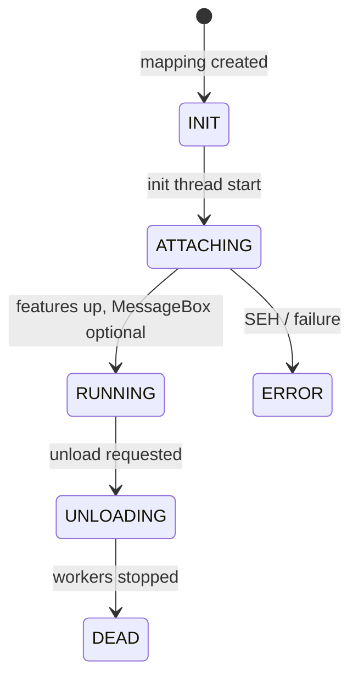

# Payload DLL reference

The reference payload (`payload_dll.dll`) demonstrates how a manual-mapped DLL can confirm injection, log diagnostics, and communicate with the injector. Shared definitions live in `manual_map/include/payload/payload_shared.hpp`.

*Screenshot placeholder: MessageBox shown inside target after attach.*

---

## Detection by injector

`payload_bridge.cpp` enables the payload protocol when either:

1. PE export **`PayloadGetVersion`** exists (`pe_has_export`), or
2. Filename is **`payload_dll.dll`**.

When enabled and `config.payload_enabled` is true, the injector creates shared memory and passes a filled **`payload_config`** as manual map `reserved` data.

---

## Configuration struct (`payload_config`)

| Field | Purpose |
|-------|---------|
| `magic` | Must be `PAYLOAD_CONFIG_MAGIC` (`PDFG`) |
| `version` | Protocol version (`2`) |
| `struct_size` | `sizeof(payload_config)` for forward compatibility |
| `feature_flags` | Bitmask of `payload_feature_flags` |
| `delay_ms` | Delay before init thread runs features |
| `heartbeat_interval_ms` | Sleep between heartbeat increments |
| `snapshot_mode` | Module/thread snapshot flags |
| `ui_message` | MessageBox body (wide) |
| `log_path` | Append log file (wide) |
| `proof_dir` | Directory for JSON proof and snapshots |
| `plugin_path` | Optional second DLL to `LoadLibrary` |
| `cli_notes` | Text from GUI Advanced settings |
| `ipc_pipe_name` | `\\.\pipe\ManualMapPayload_<pid>` |
| `status_mapping_name` | `Local\ManualMapPayloadStatus_<pid>` |

Built by `build_payload_config()` from `app_config` GUI settings.

---

## Feature flags

| Flag | Default | Behavior |
|------|---------|----------|
| `PAYLOAD_FEATURE_SHOW_MESSAGE` | on | MessageBox on successful init |
| `PAYLOAD_FEATURE_FILE_LOG` | on | Append lines to `log_path` |
| `PAYLOAD_FEATURE_DEBUG_LOG` | on | `OutputDebugStringA` |
| `PAYLOAD_FEATURE_ATTACH_CONSOLE` | off | `AllocConsole` in target |
| `PAYLOAD_FEATURE_HEARTBEAT` | on | Thread increments shared counter |
| `PAYLOAD_FEATURE_PROOF_FILE` | on | Writes `manual_map_<pid>.json` |
| `PAYLOAD_FEATURE_MODULE_WATCH` | on | `LdrRegisterDllNotification` |
| `PAYLOAD_FEATURE_LOADLIB_HOOK` | on | Detour on `LoadLibraryW` |
| `PAYLOAD_FEATURE_HOTKEYS` | on | F8/F9/F10 handlers |
| `PAYLOAD_FEATURE_IPC_PIPE` | on | Named pipe server thread |
| `PAYLOAD_FEATURE_HOST_SNAPSHOT` | on | Module/thread list files on attach |
| `PAYLOAD_FEATURE_DELAYED_INIT` | when delay_ms > 0 | Sleep before init |
| `PAYLOAD_FEATURE_PLUGIN_LOADER` | when path set | Load plugin DLL |
| `PAYLOAD_FEATURE_OVERLAY` | on | Topmost tool window (F8 toggle) |
| `PAYLOAD_FEATURE_SILENT` | off | Clears show message when set from GUI |

---

## Shared status block (`payload_shared_status`)

Mapped file: **`Local\ManualMapPayloadStatus_<pid>`**

| Field | Meaning |
|-------|---------|
| `state` | `PAYLOAD_STATUS_INIT` .. `RUNNING` .. `ERROR` |
| `pid` | Target process ID |
| `module_base` / `module_size` | Mapped payload base |
| `heartbeat_count` | Incremented by heartbeat thread |
| `attach_tick` | `GetTickCount64` at attach |
| `host_module_count` | Updated on module dump |
| `message` | ASCII status message |

Injector waits for **`PAYLOAD_STATUS_RUNNING`** in `verify_payload_handshake` (8 second timeout).

---

## Init sequence (`payload_init_thread`)

1. Optional delayed sleep.
2. Optional console attach.
3. Log CLI notes if present.
4. Host snapshot + proof file.
5. Start module watch, LoadLibrary hook, heartbeat, IPC, hotkeys, overlay.
6. Load plugin if configured.
7. Update shared status to **RUNNING**.
8. Show MessageBox if `SHOW_MESSAGE` flag set.
9. Loop until unload requested or shutdown.

Structured exception handling logs errors to shared status.

---

## Exported API

| Export | Signature | Description |
|--------|-----------|-------------|
| `PayloadGetVersion` | `uint32_t()` | Returns `PAYLOAD_API_VERSION` (2) |
| `PayloadGetStatus` | `uint32_t(payload_shared_status* out)` | Copies current shared status |
| `PayloadRequestUnload` | `uint32_t()` | Sets unload flag |
| `PayloadDumpModules` | `uint32_t(wchar_t* buf, uint32_t chars)` | Toolhelp module list |
| `PayloadSnapshotMemory` | `uint32_t(uint64_t addr, uint32_t size, const wchar_t* path)` | Dump memory region to file |

---

## IPC pipe protocol

**Pipe name:** `\\.\pipe\ManualMapPayload_<pid>`

Request struct: `payload_ipc_request` (command, size, address, path)  
Response struct: `payload_ipc_response` (result, bytes_written, message)

| Command | Value | Action |
|---------|-------|--------|
| `PAYLOAD_IPC_PING` | 1 | Returns pong with PID and heartbeat |
| `PAYLOAD_IPC_UNLOAD` | 2 | Requests graceful unload |
| `PAYLOAD_IPC_DUMP_MODULES` | 3 | Module list in response message buffer |
| `PAYLOAD_IPC_SNAPSHOT` | 4 | Memory dump to path in request |
| `PAYLOAD_IPC_STATUS` | 5 | Text summary of shared status |

Injector helper: `send_payload_ipc_command(session, PAYLOAD_IPC_PING, log)` after successful inject.

---

## Hotkeys (in target process)

| Key | Action |
|-----|--------|
| F8 | Show/hide overlay window |
| F9 | Write host snapshot again |
| F10 | Request unload |

---

## Source files (`payload_dll/`)

| File | Role |
|------|------|
| `dllmain.cpp` | Entry, validates config magic or builds fallback defaults |
| `payload_runtime.cpp` | All feature threads, hook, logging, IPC server |
| `payload_exports.cpp` | DLL export thunks |
| `payload_internal.h` | Internal declarations |

---

## GUI settings

All payload toggles are under **Settings → Payload DLL**. See [gui-application.md](gui-application.md).

Persistence keys listed in [configuration-reference.md](configuration-reference.md).

---

## Testing with Notepad

1. Build `payload_dll.dll` to `bin\Release\x64\`.
2. Enable **Show message box on attach**, disable **Silent**.
3. Inject into Notepad.
4. Expect MessageBox titled **Manual Map - Injection Successful** and GUI status **payload verified**.

Proof artifacts default under `%TEMP%\manual_map_proofs\` and log under `%TEMP%\manual_map_payload.log` unless paths overridden in settings.
