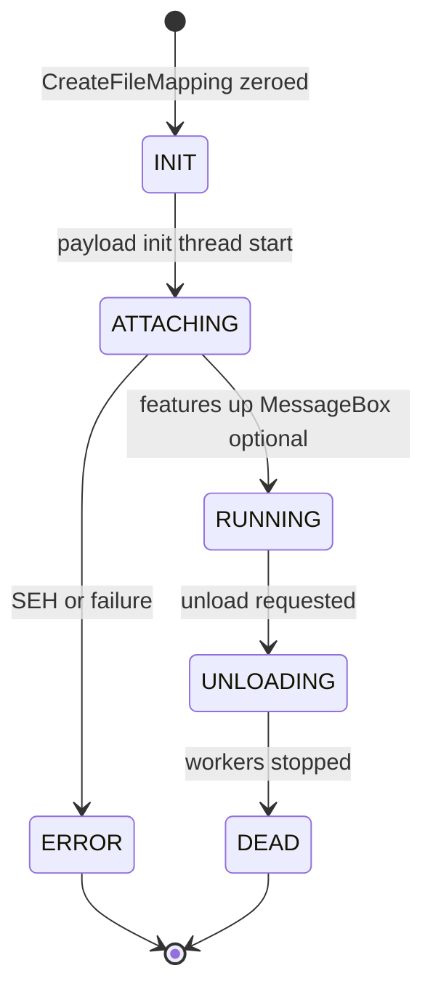
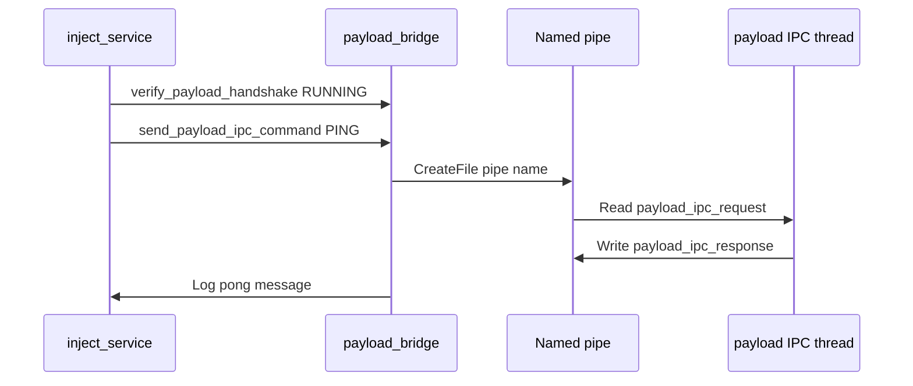

# Payload DLL reference

The reference payload (`payload_dll.dll`) demonstrates how a manual-mapped DLL can confirm injection, log diagnostics, and communicate with the injector. Shared definitions live in `manual_map/include/payload/payload_shared.hpp`.

See also: [Manual map engine](manual-map-engine.md), [GUI application - Payload settings](gui-application.md#payload-dll), [Configuration reference](configuration-reference.md#payload-dll-settings), [Architecture](architecture.md).


*MessageBox in target process after successful attach (when Show message is enabled and Silent is off).*

---

## Detection by injector

Logic in `dll_supports_payload_protocol` in `manual_map/src/app/payload_bridge.cpp`.

Protocol is enabled when **either**:

1. PE export **`PayloadGetVersion`** exists (`pe_has_export` in `pe_util.cpp`), or
2. Filename is **`payload_dll.dll`** (case-insensitive).

When enabled **and** `config.payload_enabled` is true, the injector:

1. Builds `payload_config` via `build_payload_config`.
2. Creates file mapping for shared status (`prepare_payload_session`).
3. Passes `&session.config` as manual map `reserved` to `c_manual_map::inject_pid`.

If `CreateFileMapping` or `MapViewOfFile` fails, session falls back to non-payload inject (mapping still works, no handshake).

---

## Configuration struct (`payload_config`)

Defined in `manual_map/include/payload/payload_shared.hpp`, packed with `#pragma pack(push, 1)`.

| Field | Type | Purpose |
|-------|------|---------|
| `magic` | `uint32_t` | Must be `PAYLOAD_CONFIG_MAGIC` (`0x50444647`, ASCII PDFG) |
| `version` | `uint32_t` | Protocol version (`2`, `PAYLOAD_SHARED_VERSION`) |
| `struct_size` | `uint32_t` | `sizeof(payload_config)` for forward compatibility |
| `feature_flags` | `uint32_t` | Bitmask of `payload_feature_flags` |
| `delay_ms` | `uint32_t` | Delay before init thread runs features |
| `heartbeat_interval_ms` | `uint32_t` | Sleep between heartbeat increments |
| `snapshot_mode` | `uint32_t` | Module/thread snapshot flags (`PAYLOAD_SNAPSHOT_*`) |
| `ui_message` | `wchar_t[128]` | MessageBox body |
| `log_path` | `wchar_t[MAX_PATH]` | Append log file |
| `proof_dir` | `wchar_t[MAX_PATH]` | Directory for JSON proof and snapshots |
| `plugin_path` | `wchar_t[MAX_PATH]` | Optional second DLL to `LoadLibrary` |
| `cli_notes` | `wchar_t[512]` | Text from GUI Advanced settings |
| `ipc_pipe_name` | `wchar_t[64]` | `\\.\pipe\ManualMapPayload_<pid>` |
| `status_mapping_name` | `wchar_t[64]` | `Local\ManualMapPayloadStatus_<pid>` |

Built by `build_payload_config()` from `app_config` GUI settings and target PID.

**Forward compatibility:** Payload `DllMain` checks `incoming->struct_size >= sizeof(payload_config)` before read.

---

## Feature flags

Enum in `payload_shared.hpp`:

| Flag | Bit | Default in `PAYLOAD_FEATURE_DEFAULT` | Behavior |
|------|-----|-------------------------------------|----------|
| `PAYLOAD_FEATURE_SILENT` | 0 | off | Clears show message when set from GUI |
| `PAYLOAD_FEATURE_SHOW_MESSAGE` | 1 | on | MessageBox on successful init |
| `PAYLOAD_FEATURE_FILE_LOG` | 2 | on | Append lines to `log_path` |
| `PAYLOAD_FEATURE_DEBUG_LOG` | 3 | on | `OutputDebugStringA` |
| `PAYLOAD_FEATURE_ATTACH_CONSOLE` | 4 | off | `AllocConsole` in target |
| `PAYLOAD_FEATURE_HEARTBEAT` | 5 | on | Thread increments shared counter |
| `PAYLOAD_FEATURE_PROOF_FILE` | 6 | on | Writes `manual_map_<pid>.json` |
| `PAYLOAD_FEATURE_MODULE_WATCH` | 7 | on | `LdrRegisterDllNotification` |
| `PAYLOAD_FEATURE_LOADLIB_HOOK` | 8 | on | Detour on `LoadLibraryW` |
| `PAYLOAD_FEATURE_HOTKEYS` | 9 | on | F8/F9/F10 handlers |
| `PAYLOAD_FEATURE_IPC_PIPE` | 10 | on | Named pipe server thread |
| `PAYLOAD_FEATURE_HOST_SNAPSHOT` | 11 | on | Module/thread list files on attach |
| `PAYLOAD_FEATURE_DELAYED_INIT` | 12 | when delay_ms > 0 | Sleep before init |
| `PAYLOAD_FEATURE_PLUGIN_LOADER` | 13 | off unless path | Load plugin DLL |
| `PAYLOAD_FEATURE_OVERLAY` | 14 | on | Topmost tool window (F8 toggle) |

GUI toggles map through `build_payload_config` which sets/clears bits based on `app_config` booleans.

---

## Shared status block (`payload_shared_status`)

Mapped file name: **`Local\ManualMapPayloadStatus_<pid>`** (injector creates, payload opens).

| Field | Meaning |
|-------|---------|
| `magic` | `PAYLOAD_SHARED_MAGIC` (PMMM) |
| `version` | Struct version |
| `state` | `PAYLOAD_STATUS_INIT` .. `RUNNING` .. `ERROR` |
| `pid` | Target process ID |
| `module_base` / `module_size` | Mapped payload base |
| `heartbeat_count` | Incremented by heartbeat thread |
| `attach_tick` | `GetTickCount64` at attach |
| `last_error` | SEH or Win32 error code on failure |
| `host_module_count` | Updated on module dump |
| `tls_ran` | TLS callback count |
| `message` | ASCII status message (256 chars) |

Injector waits for **`PAYLOAD_STATUS_RUNNING`** in `verify_payload_handshake` (**8000 ms** timeout, poll every 50 ms in `payload_bridge.cpp`).



State constants:

| Value | Name |
|-------|------|
| 0 | `PAYLOAD_STATUS_INIT` |
| 1 | `PAYLOAD_STATUS_ATTACHING` |
| 2 | `PAYLOAD_STATUS_RUNNING` |
| 3 | `PAYLOAD_STATUS_UNLOADING` |
| 4 | `PAYLOAD_STATUS_DEAD` |
| 0x80000000 | `PAYLOAD_STATUS_ERROR` |

---

## DllMain entry (`payload_dll/dllmain.cpp`)

```cpp
BOOL APIENTRY DllMain( HMODULE module , DWORD reason , LPVOID reserved )
```

**`DLL_PROCESS_ATTACH` flow:**

1. `DisableThreadLibraryCalls(module)`.
2. If `reserved` non-null:
   - Cast to `const payload_config*`.
   - If `magic == PAYLOAD_CONFIG_MAGIC` and `struct_size >= sizeof(payload_config)`:
     - Call `payload_runtime_init(module, reserved)`.
3. Else build `g_fallback_config` via `build_default_config` (local PID in pipe/mapping names).
4. Return result of `payload_runtime_init` (FALSE fails entire map with loader status -5).

**`DLL_PROCESS_DETACH`:** `payload_runtime_shutdown()`.

**Edge case:** Manual map without injector protocol still runs payload with fallback config if init succeeds.

---

## Init sequence (`payload_init_thread` in `payload_runtime.cpp`)

Typical order (feature-gated by flags):

1. Optional delayed sleep (`PAYLOAD_FEATURE_DELAYED_INIT`).
2. Optional console attach.
3. Log CLI notes if present.
4. Open shared status mapping by name from config.
5. Host snapshot + proof file.
6. Start module watch, LoadLibrary hook, heartbeat, IPC pipe server, hotkeys, overlay thread.
7. Load plugin if configured.
8. Update shared status to **RUNNING**.
9. Show MessageBox if `SHOW_MESSAGE` and not `SILENT`.
10. Loop until unload requested or process exit.

Structured exception handling logs errors to shared status (`PAYLOAD_STATUS_ERROR`, `message` field).

---

## Exported API

Implementations in `payload_dll/payload_exports.cpp`:

| Export | Signature | Description |
|--------|-----------|-------------|
| `PayloadGetVersion` | `uint32_t()` | Returns `PAYLOAD_API_VERSION` (2) |
| `PayloadGetStatus` | `uint32_t(payload_shared_status* out)` | Copies current shared status |
| `PayloadRequestUnload` | `uint32_t()` | Sets unload flag |
| `PayloadDumpModules` | `uint32_t(wchar_t* buf, uint32_t chars)` | Toolhelp module list |
| `PayloadSnapshotMemory` | `uint32_t(uint64_t addr, uint32_t size, const wchar_t* path)` | Dump memory region to file |

Exports enable injector auto-detection (`PayloadGetVersion`) and external tooling.

---

## IPC pipe protocol

**Pipe name:** `\\.\pipe\ManualMapPayload_<pid>` (server in payload, client in injector `send_payload_ipc_command`).

Request: `payload_ipc_request`  
Response: `payload_ipc_response`

| Command | Value | Action |
|---------|-------|--------|
| `PAYLOAD_IPC_PING` | 1 | Returns pong with PID and heartbeat |
| `PAYLOAD_IPC_UNLOAD` | 2 | Requests graceful unload |
| `PAYLOAD_IPC_DUMP_MODULES` | 3 | Module list in response message buffer |
| `PAYLOAD_IPC_SNAPSHOT` | 4 | Memory dump to path in request |
| `PAYLOAD_IPC_STATUS` | 5 | Text summary of shared status |

Injector sends **`PAYLOAD_IPC_PING`** after successful handshake when `config.payload_ipc_pipe` is true.



---

## Hotkeys (in target process)

Registered when `PAYLOAD_FEATURE_HOTKEYS` set:

| Key | Action |
|-----|--------|
| F8 | Show/hide overlay window |
| F9 | Write host snapshot again |
| F10 | Request unload |

Hotkeys require a message pump in the target. Notepad has one; some console-only targets may not deliver hotkeys.

---

## Source files (`payload_dll/`)

| File | Role |
|------|------|
| `dllmain.cpp` | Entry, validates config magic or builds fallback defaults |
| `payload_runtime.cpp` | All feature threads, hook, logging, IPC server, overlay |
| `payload_exports.cpp` | DLL export thunks |
| `payload_internal.h` | Internal declarations shared by payload TU |

Build output: `bin\Release\x64\payload_dll.dll`.

---

## GUI settings

All payload toggles are under **Settings - Payload DLL** in the GUI. See [gui-application.md](gui-application.md).

Persistence keys listed in [configuration-reference.md](configuration-reference.md).

---

## Testing with Notepad

1. Build `payload_dll.dll` to `bin\Release\x64\`.
2. Enable **Show message box on attach**, disable **Silent** in Settings.
3. Inject into Notepad (`notepad.exe`).
4. Expect MessageBox titled **Manual Map - Injection Successful** and GUI status **payload verified**.

Proof artifacts default under `%TEMP%\manual_map_proofs\` and log under `%TEMP%\manual_map_payload.log` unless paths overridden in settings.

---

## How to modify the payload

### Custom DLL using the protocol

1. Include `manual_map/include/payload/payload_shared.hpp` in your project.
2. Export `PayloadGetVersion` **or** name binary `payload_dll.dll` for filename detection.
3. In `DllMain`, read `payload_config` from `lpReserved` when magic matches.
4. Open status mapping using `status_mapping_name` from config (or construct from `GetCurrentProcessId()` in fallback).
5. Set `state = PAYLOAD_STATUS_RUNNING` when your init completes.

### Add a new feature flag

1. Add bit to `payload_feature_flags` in `payload_shared.hpp`.
2. Map GUI bool in `app_config` and `config.cpp`.
3. Set bit in `build_payload_config`.
4. Branch in `payload_runtime.cpp` init thread.
5. Document key in [configuration-reference.md](configuration-reference.md).

### Disable handshake for testing

Set `payload_enabled=0` in settings.ini. Inject still maps DLL but skips file mapping and verify.

---

## Debugging payload issues

| Symptom | Check |
|---------|-------|
| No MessageBox | `payload_silent=1`, or `payload_show_message=0`, or DllMain failed |
| Handshake timeout | Payload did not reach RUNNING within 8s; read `%TEMP%\manual_map_payload.log` |
| IPC ping fails | Pipe name mismatch, `payload_ipc_pipe=0`, firewall N/A for local pipe |
| Overlay missing | `payload_overlay=0`, or target has no desktop session |
| Init crash | Shared status `PAYLOAD_STATUS_ERROR`, `message` ASCII field |

Use DebugView for `OutputDebugStringA` when `payload_debug_log` enabled.

Attach debugger to **target process** after inject, symbols for `payload_dll.dll` (manual map base from shared status `module_base`).

---

## Common failure modes

| Failure | Cause | Fix |
|---------|-------|-----|
| Loader -5 | `payload_runtime_init` returned FALSE | Fix init SEH, check config pointers |
| Verified false, inject OK | Slow init or status mapping name wrong | Increase timeout (requires code change) or fix mapping name |
| Double MessageBox | Injected twice | Expected if two instances injected |
| Plugin load fail | Bad `payload_plugin_path` | Verify path accessible from target |
| Hook instability | LoadLibrary detour | Disable `payload_loadlib_hook` in settings |

---

## Related reading

- [Manual map engine - reserved buffer](manual-map-engine.md#5-reserved-buffer-for-dllmain)
- [Architecture - Configuration and state](architecture.md#configuration-and-state-ownership)
- [CLI reference](cli-reference.md) (payload flags via settings.ini)
